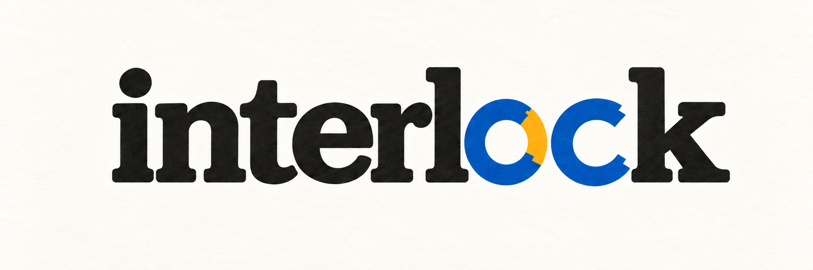
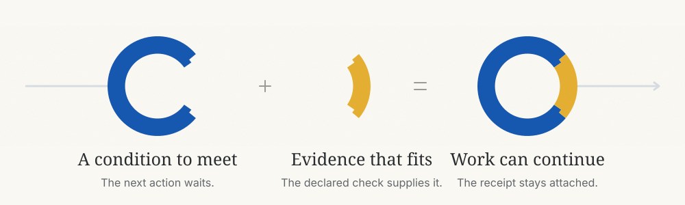
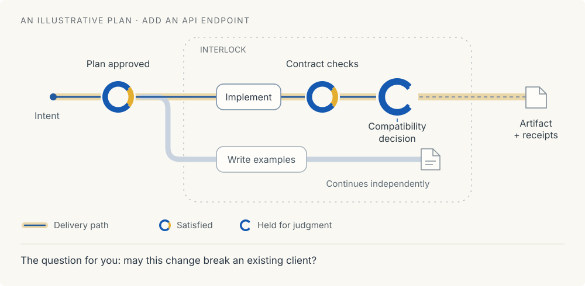

<p align="center">
  
</p>

<h1 align="center">Put proof where it matters.</h1>

<p align="center">
  An <strong>interlock</strong> is a point in a process where work needs evidence to continue.<br>
  It makes a condition explicit: what must be true, how to establish it,<br>
  and who has the authority to decide.
</p>

<picture>
  <source media="(max-width: 700px)" srcset="docs/brand/interlock-concept-mobile.svg">
  
</picture>

Interlock brings that idea to software work with agents. A plan names the work and its dependencies.
Gates define what can clear each part. The harness runs the checks and keeps the receipts behind
the result.

<p align="center"><em>The design problem is choosing the right interlocks—and making their proof worth trusting.</em></p>

<p align="center">
  <a href="#a-plan-should-be-open-to-inspection">Plans &amp; control</a> ·
  <a href="#different-questions-need-different-proof">Kinds of proof</a> ·
  <a href="#see-the-decision-that-changes-the-outcome">What needs you</a> ·
  <a href="#let-experience-refine-the-interlocks">Safe automation</a> ·
  <a href="#a-working-foundation-with-the-seams-visible">Current state</a>
</p>

> [!NOTE]
> **Early implementation.** The approval, execution, and evidence loop works through the CLI.
> Assisted planning and adaptive strategies are still design work.

## A plan should be open to inspection

A plausible plan can still solve the wrong problem. Before work starts, each node needs an
acceptance, explicit dependencies, and gates that would expose an unacceptable result. That gives
you something concrete to question.

> **Before approving a plan**
>
> Does the acceptance preserve my intent?<br>
> What would count as evidence that it was met?<br>
> Where would a wrong assumption become expensive to undo?

The graph is a file. You can change the decomposition, dependencies, acceptance, and gate placement,
whether the proposal came from you, a script, or a model. The runner requires your approval of that
exact file before starting work; an edit requires approval again.

**The worker cannot quietly lower the bar.** It can challenge a gate and explain why. A person, or
a policy a person has ratified, owns the exception and its reason. The CLI now records cancellation,
reset, and gate waivers with who authorized them and why; a waiver keeps the receipt it applies to.

Once a session starts, its brief stays fixed. Revisions do not rewrite what earlier work was asked
to do or erase the evidence it produced.

*Today, graphs are authored directly. An assisted planner is part of the design, not a finished
capability or a guarantee of good plans.*

## Different questions need different proof

A test can establish a behavior. A review can examine a tradeoff. A person can authorize a
consequence. The interlock must say which question is being answered, and which evidence is sufficient.

| Interlock | Question → evidence | Available today |
| --- | --- | --- |
| **Command** | Does this behavior hold?<br>The harness runs the declared test, build, or custom check. | Implemented |
| **Shape** | Does the change stay within its contract?<br>Inspect scope, structure, schemas, or dependencies. | Custom command checks now; dedicated kind planned |
| **Review** | Is this tradeoff acceptable?<br>A named review lens supplies an attributable judgment. | Dedicated kind planned |
| **Human** | May this action proceed?<br>An authorized person approves the specific decision. | Graph approval now; general node-level criteria planned |

Node-specific checks combine with the repository's standing checks. The broader design allows
several criteria at one interlock: human approval can sit alongside tests and review, with each
answering a different part of the question.

Every result should leave a route back to:

- **What was checked:** the declared criterion and the code content it applied to.
- **How it was checked:** the producer, method, result, and retained receipt.
- **Where it came from:** the brief, diff, and debrief behind the work.

A debrief also explains the work: what was discovered, what was decided, and where those claims
point in the code. The verifier checks those references and marks missing support.

> **Evidence can satisfy a criterion. It cannot rescue a criterion that asks the wrong question.**

A rooted claim is traceable, not automatically correct. Review judgments remain judgments. Neither
an agent's confidence nor its own report of passing tests is sufficient to clear work.

## See the decision that changes the outcome

A held node matters differently depending on what depends on it. The critical path reveals the
chain that governs completion. Other work may still have room to proceed.



*Conceptual example, not a screenshot of an existing interface. The loop is the same symbol at
every point: open while a condition is unmet, complete when its evidence is accepted.*

The next layer is meaning: **does this change the promised result, or only how we get there?** An
internal refactor and a compatibility break may both change a plan. Only one may change the decision
you thought you had made.

The intended position brings those consequences into view, then lets you descend into the node,
its work, and its receipts. Technical detail remains available without becoming the whole conversation.

*Today, the CLI shows dependencies, node state, and an unweighted critical path. Duration-aware
scheduling and the richer position are being built. Intent-sensitive summaries are a design goal;
all graph-file changes currently require renewed approval.*

## Let experience refine the interlocks

Start with a person where judgment is unresolved. Keep the reasons, evidence, corrections, and
consequences. Those records can reveal what a future rule would need to distinguish.

| 01 · Decide | 02 · Assist | 03 · Delegate |
| --- | --- | --- |
| **Human judgment**<br>A person resolves the question and records the reason. | **A recommendation**<br>A knowledge layer suggests a decision with its evidence. A person accepts or corrects it. | **A bounded rule**<br>A person authorizes a defined action in a defined context, with an expiry. |

The reusable unit is a **strategy**: a graph pattern with acceptance forms, gate rules, and reasons
for placing them. Evidence can motivate a proposal to add, move, or revise an interlock. A person
ratifies the new version.

A string of successful runs does not grant new authority. Automation needs an explicit mandate;
inherited checks remain in force. When the evidence cannot settle a decision, human judgment still
has a place.

*This is the intended evolution, not an autonomous learning feature available today. The harness
can run without a knowledge substrate; that layer may assist judgment without becoming the sole
authority to merge.*

## A working foundation, with the seams visible

Interlock's own development began with hand-authored work files. As the runner became usable, it
started checking that work and recording its evidence. That history is useful because it exposes
where the process needed stronger conditions.

One concrete lesson: a successful test command can still select no tests. Gate declarations can
now require matching output as well as a successful exit. The condition became more precise because
an actual failure mode demanded it.

- **Working:** content-specific graph approval, immutable briefs, runner-executed command gates,
  recorded outcomes, debrief verification, journal-backed session inspection, and human cancellation,
  reset, and gate waivers.
- **In progress:** a richer position with timing and float, and the read-only face.
- **Design direction:** assisted planning, composite review and human gates, and strategies revised
  from evidence.

Read the bootstrap graph from a development checkout:

```sh
pnpm interlock graph show 0001-bootstrap
```

The graph describes the work; its local journal supplies observed progress. The repository does
not yet run its bootstrap end to end unattended.

### One layer in a larger system

Interlock owns work structure and proof. [herdr](https://herdr.dev) owns sessions and terminals.
[Phyxius](https://github.com/rodrigopsasaki/phyxius) supplies the journal. A knowledge substrate is
optional. Agent runtimes stay behind adapters.

[Read the design](docs/design/0001-interlock.md) ·
[Inspect the bootstrap graph](.interlock/graphs/0001-bootstrap.yaml) ·
[Working agreement](AGENTS.md)

---

Developed by Rodrigo Sasaki. Licensed under Apache 2.0; see [LICENSE](LICENSE) and [NOTICE](NOTICE).
