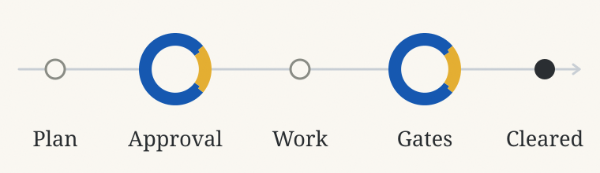
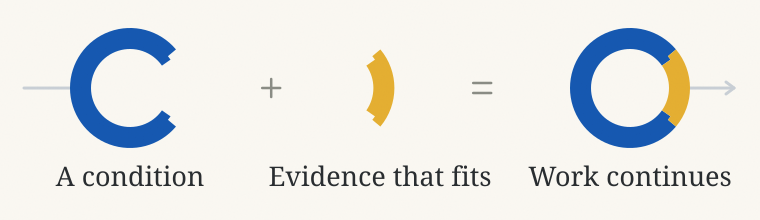

<p align="center">
  <picture>
    <source media="(prefers-color-scheme: dark)" srcset="docs/brand/interlock-wordmark-dark.png">
    <source media="(prefers-color-scheme: light)" srcset="docs/brand/interlock-wordmark.png">
    
  </picture>
</p>

<h1 align="center">Put proof where it&nbsp;matters.</h1>

<p align="center">
  An <strong>interlock</strong> is a point in a process where work needs evidence to continue.<br>
  It says what must be true, how to establish it, and who decides.
</p>

Interlock is a command-line runner for coding agents such as Claude Code, Codex and Kimi Code. You
approve a plan as a file, then start each of its nodes on the agent you choose. The runner gives
that node its own terminal pane and git worktree, runs its gates itself and keeps a receipt for
each one. A node clears on that proof, never on the agent's report of it.

<p align="center">
  <picture>
    <source media="(prefers-color-scheme: dark)" srcset="docs/brand/interlock-lifecycle-dark.svg">
    <source media="(prefers-color-scheme: light)" srcset="docs/brand/interlock-lifecycle.svg">
    
  </picture>
</p>

<p align="center"><em>Two interlocks stand between a plan and a cleared node:<br>
a person's approval of the exact plan&nbsp;file,<br>
and the gates the runner runs after the&nbsp;work.</em></p>

> [!NOTE]
> Early, and working. The loop below runs today from a clone of this repository. What is still
> design is listed under [Current state](#current-state).

**Contents:** [In&nbsp;use](#what-it-looks-like-in-use) ·
[Why](#why-the-runner-produces-the-proof) ·
[Install](#install) ·
[First&nbsp;graph](#run-your-first-graph) ·
[The&nbsp;loop](#the-loop) ·
[Your&nbsp;own&nbsp;agent](#bring-your-own-agent) ·
[Kinds&nbsp;of&nbsp;proof](#kinds-of-proof) ·
[Current&nbsp;state](#current-state) ·
[Where&nbsp;it&nbsp;is&nbsp;going](#where-it-is-going)

## What it looks like in use

A plan is a graph: a YAML file of nodes, each with an acceptance, the nodes it depends on, and the
gates that decide when it is done. This node comes from
[`0044-runtime-coverage`](.interlock/graphs/0044-runtime-coverage.yaml), one of the graphs this
repository was built with. It asked an agent to add tests for two untested code paths in
Interlock's terminal view, which the repository calls the face (acceptance shortened):

```yaml
- id: face-runtime-coverage
  depends_on: []
  acceptance: |
    …
    Add `packages/face/test/runtimeAttempts.test.ts`
    pinning: unknown sessions are skipped; the latest
    attempt per runtime wins; a runtime with no attempt
    is absent.
    …
  gates:
    - id: face-proof
      kind: command
      run: pnpm --filter face exec vitest run
        test/render.test.ts test/runtimeAttempts.test.ts
      expect_output: 'Tests +[1-9][0-9]* passed'
```

A person approves the file and writes the node's brief, the instructions the agent receives. Then
they start the node on the agent of their choice:

```sh
interlock graph approve 0044-runtime-coverage \
  --by "<you>" --because "<why this plan>"
interlock run 0044-runtime-coverage face-runtime-coverage \
  --runtime k3
```

`run` refuses unless the graph is approved for its current content, the node's dependencies are
cleared and a brief for it exists. Then it:

1. creates (or reuses) a worktree on the node's own branch;
2. leases the node, claiming it for one attempt with an expiry;
3. opens a pane in [herdr](https://herdr.dev), which hosts the agent's terminal, starts
   the agent there and hands it the brief;
4. waits for the agent to settle, meaning it goes idle or done; if it blocks on a question, the
   run waits for you to answer in its pane;
5. runs every gate in that worktree itself, whatever the agent reported.

`graph show` then prints the position, the current read of the whole graph:

```text
$ interlock graph show 0044-runtime-coverage
graph 0044-runtime-coverage — approved

fixtures-and-corpus — cleared
  gates: corpus-proof satisfied, replay-proof satisfied
  runtime: luna (codex, gpt-5.6-luna)
  float: 2547ms
face-runtime-coverage — cleared
  gates: face-proof satisfied
  runtime: k3 (kimi, kimi-code/k3)
  float: 0ms

critical path: face-runtime-coverage
```

Each node was started with its own `run` and ran unattended from there, on agents from two
vendors. `luna` and `k3` are profiles in
`runtimes.example.yaml`, the catalogue [Install](#install) has you copy, and
[Bring your own agent](#bring-your-own-agent) explains how profiles work. The critical path is the
dependency chain with the most measured gate time, and float is the gate time a node can spare;
agent working time is not counted.

Each node keeps its record. The node above declared one gate; the repository's
[standing table](.interlock/config.yaml) adds five that every node carries, and the outcome holds a
receipt for all six (excerpt):

```text
$ interlock session show 0044-runtime-coverage \
    face-runtime-coverage
0044-runtime-coverage/face-runtime-coverage · session 3f7a06e8…
…
  runtime: k3 (kimi, kimi-code/k3)
…
  typecheck: satisfied (receipt 368069dade81…e82605)
  lint: satisfied (receipt c77685879bbd…42cf4a)
  comments: satisfied (receipt 110bf4020ce1…2754f0)
  test: satisfied (receipt 46856598c9e2…c8f93b)
  debrief-valid: satisfied (receipt ab16739c68ff…1d81e1)
  face-proof: satisfied (receipt 5b0375401a3c…822306)
…
Outcome
  cleared (6 receipt(s))
```

A receipt records the gate, the commit it ran on, how long it took, who or what produced it, and
the proof: for a command gate, its exit code and the output it printed. Its id is a hash of the
gate and of the files it covers (for a command gate, every file git tracks), so the same gate over
changed files gets a new id.

The node's [brief](.interlock/sessions/0044-runtime-coverage/face-runtime-coverage/brief.md) and
its [debrief](.interlock/sessions/0044-runtime-coverage/face-runtime-coverage/debrief.yaml), the
agent's account of what it discovered and decided and the code each decision rests on, are
committed beside the graph.

## Why the runner produces the proof

An agent's report that the tests pass is a claim. The interlock is the runner running them.

Running the check is necessary, not sufficient. On 2026-09-10 a gate in this repository passed with
exit code zero although the package it named did not exist: a `pnpm --filter` that matches nothing
exits clean, and so does a test run that selects nothing
([bend log](docs/design/0001-interlock.md#bend-log)). Command gates can now require matching output
as well as a clean exit. The `expect_output` line above holds the gate unless at least one test
passed. The condition became more precise because a real failure demanded it.

> **Evidence can satisfy a criterion. It cannot rescue a criterion that asks the wrong question.**

So the plan is an interlock too. A plausible plan can still solve the wrong problem, and the graph
file is where you can catch it:

> **Before approving a plan**
>
> Does the acceptance preserve my intent?<br>
> What would count as evidence that it was met?<br>
> Where would a wrong assumption become expensive to undo?

You can change the decomposition, dependencies, acceptance and gates, whether the proposal came
from you, a script or a model. Approval is a receipt addressed to the file's exact content. Edit
it and the graph reads `stale`, and no node in it can be leased until someone approves it again.

**Nothing the agent changes in its worktree changes which gates apply.** The runner takes the gates
from the approved graph and the standing table in your checkout, never from the agent's worktree.
The gates run against the node's branch, so a change the agent makes to a test or a script is part
of the diff a person reviews before merging. What keeps an agent inside its worktree depends on
how its profile starts it; [Install](#install) says what each example profile allows.

An agent that thinks a gate is wrong says so in its debrief. Waiving a gate is a separate act,
recorded with the name of the person who waived it and their reason, and the waiver keeps the
receipt it applies to. A brief is fixed once its session starts, so a later revision cannot rewrite
what earlier work was asked to do or erase the evidence it produced.

## Install

> [!IMPORTANT]
> There is no published package yet. Interlock runs from a clone of this repository, through a
> two-line `interlock` script on your PATH.

You need:

- git, pnpm and Node 24.14.0, the version pinned in `.node-version`.
- [mise](https://mise.jdx.dev). The runner runs every gate and worktree setup command through
  `mise exec`, so each runs on the toolchain its repository pins. Current mise reads
  `.node-version` only once the first line below turns that on.
- To run nodes, a running [herdr](https://herdr.dev) and an agent CLI it can start. Claude Code,
  Codex and Kimi Code are the ones this repository has run on.

```sh
mise settings add idiomatic_version_file_enable_tools node
git clone https://github.com/rodrigopsasaki/interlock.git
cd interlock
pnpm install
mkdir -p ~/.local/bin
cat > ~/.local/bin/interlock <<EOF
#!/bin/sh
exec mise exec node@24.14.0 -- \
  node "$PWD/packages/cli/src/bin.ts" "\$@"
EOF
chmod +x ~/.local/bin/interlock
```

Make sure `~/.local/bin` is on your PATH. A shell alias is not enough: the runner tells each agent
to file its debrief by calling `interlock` by name, from a pane that never sees your aliases. The
script pins Node itself because it runs in your other repositories and their agent panes, where
the clone's `.node-version` does not apply and an older Node cannot load the CLI's TypeScript.

Then describe the agents this machine can start, in a catalogue that lives outside any repository,
in `~/.config/interlock/` (or `$XDG_CONFIG_HOME/interlock/` if you set it; `INTERLOCK_RUNTIMES`
overrides the path):

```sh
mkdir -p ~/.config/interlock
cp runtimes.example.yaml ~/.config/interlock/runtimes.yaml
interlock runtime list
```

> [!WARNING]
> Every example profile starts its agent unattended, so the agent acts without asking you:
>
> - `--dangerously-skip-permissions` in the Claude Code profiles
> - `--ask-for-approval never` in the Codex profiles
> - `--auto` in the Kimi Code profile
>
> Only the Codex profiles add a sandbox that limits where the agent can write. Nothing in the
> Claude Code and Kimi Code profiles keeps the agent in its worktree; the opening prompt asks it to
> stay there.

Keep only the profiles whose CLIs you have. Each profile also names a model, in its `args` and
again as its `model` label; change both to a model your account can use.

Each Codex profile has a `<git-common-dir>` placeholder. Before you run a Codex profile in a
repository, such as the one you set up under [Run your first graph](#run-your-first-graph),
replace it with what this prints there:

```sh
git rev-parse --path-format=absolute --git-common-dir
```

The Codex sandbox lets the agent commit only there, so a Codex profile serves one repository; copy
it under a new name for each other repository.

The clone carries this repository's own plans, but not their history. Try it:

```sh
interlock graph show 0044-runtime-coverage
```

In a fresh clone it reads `not approved`, every gate pending, although
[the top of this page](#what-it-looks-like-in-use) shows it approved with both nodes cleared. The
graphs, briefs and debriefs are committed, while what happened lives in a journal under
`.interlock/ledger/`, kept per clone and shared by that clone's worktrees. That work is merged, so
the next thing to run is a graph of your own.

## Run your first graph

The CLI works on whichever repository you run it in: it looks for a `.interlock` directory in the
current directory or a parent. In your own repository, four files make a node runnable. The
example node adds a one-file script, so it needs only `node`; the test command is a placeholder
for your repository's own.

**1. The standing table,** `.interlock/config.yaml`: the gates every node carries.

```yaml
interlock: config@v0
standing_gates:
  - id: test
    kind: command
    run: npm test
substrate: { address: none }
```

Use your repository's own test command in place of `npm test`; if it already fails on your
current commit, every node will be held. Gate commands are split into words and run without a
shell, so `&&` and pipes do not work; put the logic in a script and call that. The `substrate`
line is part of this file's shape; the address the runner uses is set in step 4.

**2. A graph,** `.interlock/graphs/0001-first.yaml`:

```yaml
interlock: graph@v0
id: 0001-first
ask: Add a greeting and prove it prints.
gates:
  - id: approved # cleared by `interlock graph approve`
    kind: human
nodes:
  - id: greet
    depends_on: []
    acceptance: Add greet.js, which prints hello.
    gates:
      - id: greets
        kind: command
        run: node greet.js
        expect_output: hello
```

**3. A brief,** `.interlock/sessions/0001-first/greet/brief.md`: front matter, then what the agent
should know, the acceptance included. The agent reads the brief, not the graph.

```md
---
interlock: brief@v1
graph: 0001-first
node: greet
role: worker
gates: []
scope: []
substrate: { address: none }
---

Add `greet.js`, which prints `hello`. The `greets` gate
runs `node greet.js` and needs that word in its output.
```

Leave `gates` and `scope` empty. When the runner leases the node it fills them in from the graph,
the standing table and the files git tracks, and commits the result in the node's worktree. A brief
without front matter still passes `brief validate`, as `brief@v0`, but `run` refuses it.

**4. This machine's settings.** Copy `.interlock/local.example.yaml` from your Interlock clone to
`.interlock/local.yaml`. It sets the profile to start, where worktrees go, how long leases and
runs last, and the address of a substrate, an optional service that holds knowledge about the
code; the example's `none` runs without one. In the copy, set `default_runtime` to a profile you
kept in the catalogue; the example names `sonnet`. Uncomment `worktree_setup` only if a fresh
worktree needs something installed before its gates can run, such as your package manager's
install command; it defaults to none.

Add these lines to `.gitignore` to keep `local.yaml` out of git, along with the journal, the node
worktrees and the screen the runner saves when it judges a node. A saved screen that git can see
counts as uncommitted work and holds the node the next time its worktree is judged.

```text
.interlock/local.yaml
.interlock/ledger/
.worktrees/
.interlock/sessions/**/screen.txt
```

**Then commit, check, approve and run.** A node's worktree starts from your current commit, so the
graph and brief go in first:

```sh
git add .gitignore .interlock
git commit -m "Plan a first graph"
interlock brief validate 0001-first greet
interlock graph approve 0001-first \
  --by "<you>" --because "<why this plan>"
interlock run 0001-first greet
```

The agent works in a worktree under `.worktrees/`, on `graph/0001-first/greet`, a branch of its
own. `run` stays in the foreground until the agent goes idle or done, for up to `run_timeout_ms`
(an hour in the example file); watch the agent in its herdr pane meanwhile, and answer there if it
asks a question. If it has not settled when that time runs out, no gate runs and the pane stays
open; once its lease lapses (`lease_ms`), `interlock judge 0001-first greet` runs the gates on what
the agent left. Otherwise the runner runs `test` and `greets` there, and `interlock graph show 0001-first`
shows whether `greet` cleared. Merging the branch is yours to do.

## The loop

The two interlocks drawn at the top bracket every node. Between them the work belongs to the
agent, in its own worktree and pane.

```text
interlock plan <graph> --ask "<what you want done>"
interlock plan <graph> --correction "<what to change>"
interlock graph approve <graph> --by "<you>" --because "<why>"
interlock brief validate <graph> <node>
interlock run <graph> <node> --runtime <name>
interlock judge <graph> <node>
interlock gate clear <graph> <node> <gate> \
  --by "<you>" --because "<why>"
```

1. **Plan.** Write `.interlock/graphs/<graph>.yaml` by hand, or let `plan` draft it. Planning is a
   session of its own: an agent writes the graph and a debrief in the worktree
   `.worktrees/plan/<graph>`, on the branch `graph/<graph>/plan/<graph>`, and the graph lands
   there not approved. Review it in that worktree.
   - To approve on your main checkout, merge that branch first.
   - To approve where it was drafted, copy `local.yaml` into that worktree and run `approve` and
     `run` there.

   Every worktree of a clone shares one journal, so the record is the same either way. The second
   `plan` line above reopens a drafted graph in a new planning session, which gets the draft and
   your reason.
2. **Approve.** A person approves the exact file, as [Why](#why-the-runner-produces-the-proof)
   describes.
3. **Brief.** You write each node's brief and `brief validate` checks it. The runner never authors
   it; at lease it fills in the gates, the scope, the session's base commit and any context a
   substrate supplies, and appends standard guidance on writing the debrief. It does not add the
   acceptance, so the brief has to state it.
4. **Run.** One `run` starts one node. Nothing starts the next node when its dependencies clear;
   you start each one. The node is cleared when every gate is satisfied and held otherwise. A
   worktree left with uncommitted changes is held before any gate runs. A held node keeps its pane
   open so you can look, and `judge` judges the settled worktree again by hand.
5. **Decide.** A human gate on a node waits for a person; `gate clear` records who cleared it and
   why.
6. **Merge.** Each node's work sits on its own branch, `graph/<graph>/<node>`. A person merges it.
   Nothing in Interlock merges.

`interlock face [graph]` opens the face, a terminal view that descends from plans to a graph's
position, a node and a session. It writes nothing itself; its keys run the same CLI verbs.

<details>
<summary><strong>Exceptions, reads and the face's keys</strong></summary>

<br>

Exceptions are recorded too. Each command below takes the graph id, then the node and gate ids
where it acts on one; `cancel`, `reset` and `waive` refuse without `--by` and `--because`.

| Command | Use it to |
| --- | --- |
| <code>node&nbsp;cancel</code> | Stop a node; `reset` and `cancel` refuse to move it again, though a new `run` starts a fresh attempt. |
| <code>node&nbsp;reset</code> | Start a node over. |
| <code>gate&nbsp;waive</code> | Let a node past a gate it did not satisfy; the receipt stays. |
| `sweep` | Close leases that expired without an outcome; each is recorded as cancelled by the sweeper; run the node again to retry. Takes no ids. |
| `backfill` | Re-run every gate on `main` for nodes whose debrief is committed, such as work that cleared outside the runner. Assumes a pnpm repository today. |

To read where things stand:

| Command | Shows |
| --- | --- |
| <code>graph&nbsp;show</code> | The position: each node's state, gates and runtime, the critical path and float, as text or JSON. |
| <code>graph&nbsp;status</code> | With `--expect`, whether every node has that outcome or a live lease, as an exit code for scripts. |
| <code>session&nbsp;show</code> | One session: brief, receipts, discoveries, decisions, notes and the runner's step-by-step log. |
| `verify` | The verifier's marks on the filed debrief. |
| `evidence` | With `--delivery`, its delivery to a substrate; without it, the evidence a judged session produced. |
| <code>runtime&nbsp;list</code> | Every runtime profile and its last attempt. Takes no ids. |

In the face: <kbd>a</kbd> approve, <kbd>R</kbd> run, <kbd>J</kbd> judge, <kbd>c</kbd> cancel,
<kbd>x</kbd> reset, <kbd>w</kbd> waive, <kbd>b</kbd> backfill, <kbd>s</kbd> sweep, and
<kbd>Enter</kbd> on a live attempt focuses its pane. The verbs that record who and why ask for
both; `INTERLOCK_BY` fills in who.

</details>

## Bring your own agent

A graph never says which agent runs a node. A runtime is a named profile in the per-machine
catalogue: the agent kind herdr starts, its arguments, a model label kept for the record, and the
answers to any prompt the agent shows before it is ready. You choose one per attempt with
`--runtime`; without it, the checkout's `default_runtime` applies.

The kind must be one herdr knows how to start, from the list in
[the herdr adapter](packages/runner/src/herdr/adapter.ts); `gemini`, `cursor`, `opencode`,
`copilot` and `amp` are among them, and any other kind is refused. Only `claude`, `codex` and
`kimi` have been run through Interlock so far.

The session records which runtime ran. `graph show` prints it for each node, and `runtime list`
shows each profile's last attempt, so whether a profile works on this machine is answered by the
record rather than by a probe.

## Kinds of proof

<p align="center">
  <picture>
    <source media="(prefers-color-scheme: dark)" srcset="docs/brand/interlock-concept-dark.svg">
    <source media="(prefers-color-scheme: light)" srcset="docs/brand/interlock-concept.svg">
    
  </picture>
</p>

The name comes from the railway interlocking, the mechanism in a signal box that makes an unsafe
signal impossible to set, whatever the signaller intends. Every interlock here has the shape drawn
above, the same one the wordmark's c and o show: a condition, the evidence that fits it, and the
work it lets continue. What differs is the question. A test can establish a behavior. A review can
examine a tradeoff. A person can authorize a consequence.

| Interlock | Today | Question and evidence |
| --- | --- | --- |
| **Approval** | Works | May this plan run as written?<br>A person approves the exact graph file. |
| **Command** | Works | Does this behavior hold?<br>The runner executes the declared command in the node's worktree; an optional output pattern must match. |
| **Human** | Works | May this decision proceed?<br>A person clears a named gate on a node. |
| **Shape** | Partly | Does the change stay within its contract?<br>Checks on scope, structure, schemas or dependencies, written today as command gates. |
| **Review** | Design | Is this tradeoff acceptable?<br>A named review lens gives an attributable judgment. |

The debrief is checked too. The verifier follows each claim's code reference and marks the claim
rooted or unrooted; a rooted claim is traceable, not automatically correct.

## Current state

Interlock is built with itself. Its graphs are in [`.interlock/graphs`](.interlock/graphs), and
each session's brief, notes and debrief are under [`.interlock/sessions`](.interlock/sessions). Its
development began with hand-authored work files; as the runner became usable, it started checking
that work and recording its evidence. That history is useful because it shows where the process
needed stronger conditions.

**Works today**

- [x] Graphs as files, written by hand or drafted by an agent with `plan`
- [x] Approval addressed to the graph file's content; an edit makes it stale
- [x] Command gates run by the runner, with `expect_output`, retained output and measured durations
- [x] Standing gates every node carries, and human gates on nodes
- [x] Cancel, reset and waive, each recorded with who and why
- [x] Runs in herdr panes on Claude Code, Codex and Kimi Code profiles from the catalogue, chosen
  per attempt
- [x] Leases with expiry, `sweep`, and `backfill` to re-judge committed work on `main`
- [x] Debriefs filed, versioned and verified with deterministic marks
- [x] The position, with critical path and float, as text or JSON
- [x] The face, with its verbs and pane focus
- [x] An optional substrate by address: context into the brief, filed debriefs delivered to it

**Design only**

- [ ] Dedicated shape and review gates, gates that combine several criteria, and gates that hold a
  merge
- [ ] Retry budgets and automatic retry
- [ ] Marking downstream nodes stale when an upstream outcome changes
- [ ] Mandates: bounded, expiring grants that let automation act for a person
- [ ] Strategies: reusable graph patterns revised from evidence
- [ ] Verifier marks produced by a model
- [ ] Position summaries that say which change matters to your intent
- [ ] A phone channel: the position sent to your phone, and verbs answered from it
- [ ] tmux as a second pane host; herdr is the only one the runner starts today

## Where it is going

The next layer is meaning: **does this change the promised result, or only how we get there?** An
internal refactor and a compatibility break may both change a plan. Only one may change the
decision you thought you had made. Today any edit to a graph file needs approval again.

Start with a person where judgment is unresolved. Keep the reasons, evidence, corrections and
consequences; those records show what a future rule would need to distinguish.

| 01 · Decide | 02 · Assist | 03 · Delegate |
| --- | --- | --- |
| A person resolves the question and records the reason. | A substrate suggests a decision with its evidence. A person accepts or corrects it. | A person authorizes a defined action in a defined context, with an expiry. |

A string of successful runs does not grant new authority. Automation needs an explicit mandate, and
inherited checks remain in force. Today every waiver, reset and cancel is a person's decision;
`sweep` only closes leases that have already expired.

### One layer in a larger system

Interlock owns the structure of work and its proof. It is not an agent, and no model holds its
state or decides what runs next; the runner is plain code. [herdr](https://herdr.dev) owns the
agent processes and their terminal panes. [Phyxius](https://github.com/rodrigopsasaki/phyxius) supplies the journal. A
substrate is optional; with its address set to `none`, everything still runs. Agent runtimes stay
behind adapters.

## Read further

- [Design note](docs/design/0001-interlock.md): decisions, invariants, and a bend log of every place
  the design gave way in use.
- [The face](docs/design/0002-face.md), [the substrate protocol](docs/design/0003-substrate.md) and
  [the artifact shapes](docs/shapes.md), including every field of a brief.
- [Working agreement](AGENTS.md): axioms, invariants and the closed vocabulary.
- [The bootstrap graph](.interlock/graphs/0001-bootstrap.yaml): the graph that built the runner.

---

Developed by Rodrigo Sasaki. Licensed under Apache 2.0; see [LICENSE](LICENSE) and [NOTICE](NOTICE).
