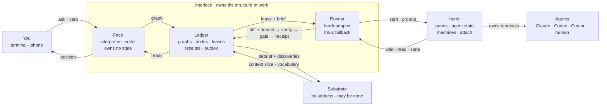
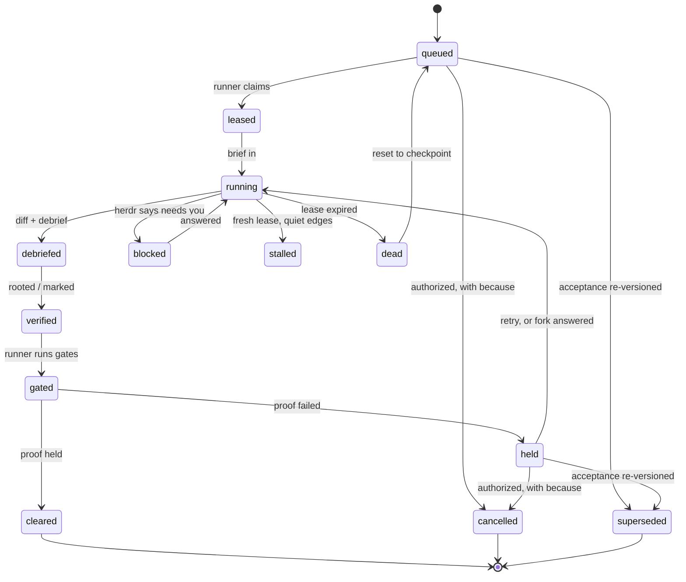

# Interlock

Design note · v0.11 · 2026-09-10

A harness for doing software work with agents: enough context that they decide and manage their
own work, enough structure that you never lose control. Named for the railway interlocking: the mechanism that makes an unsafe signal impossible
to set. This note is the thing we weigh against when it bends.

| | |
| --- | --- |
| Status | Decided. Two nodes of the bootstrap graph cleared; the rest not built. TypeScript on Node. |
| Owner | Rodrigo Sasaki, own repository, Apache 2.0. The first company adopter arrives by config and an address only. |
| Composes | herdr for processes. A substrate for beliefs about code. Interlock for the structure of work. |
| How to read | Decisions are D-numbered, invariants I-numbered. The bend log cites them. A decision may bend with a written entry. An invariant bending means the design is wrong, not the invariant. |

## What we are pushing it for

Three outcomes, in order of weight.

**Control without watching.** You hold a position and are told when it should change. You do
not watch. Everything you delegate to is judgment you already did, held in structure that every
agent reads.

**Giveable to a multitude.** Anyone keeps their own agent, editor and model. What they adopt is a
practice with a reference implementation, and an exit that costs them a habit, not their work.

**Compounding.** Every session leaves a typed trace. What the agent had to discover is what the
briefs failed to say. Read in aggregate, that is the organisation's judgment accreting.

### How we weigh

When a tradeoff is genuinely open, these break the tie, in this order.

1. **Better is a direction, good is a threshold.** Ship the reasonably usable thing with escape
   hatches. An incomplete answer is not a wrong one.
2. **Never compress without keeping the way back.** A brief, a debrief, a receipt is a compression
   with provenance. A log line is a compression without one. Build the first kind.
3. **Position, not events.** The unit of human legibility is the current read. Events are receipts
   you pull, never the utterance.
4. **Compose, don't reinvent.** If prior art owns a layer with no judgment of ours in it, use it
   behind one adapter.
5. **Dogfood, or don't build it.** If we would not use interlock for the thing it is meant for, we
   should not be developing it.

## The shape

*Figure 1. Three owners, one loop. The face, ledger and runner are interlock. The substrate and
herdr are reached over an address and a socket, never imported. The loop that compounds is the
return from runner to ledger: what comes back from a session is verified and gated before it
becomes a receipt, and its discoveries go up to the substrate.*

### Layers and owners

| layer | owns | never does | reached by |
| --- | --- | --- | --- |
| herdr | Panes, processes, agent state (working, blocked, idle, done), machines over SSH, attach from anywhere, native session resume. | Know why an agent runs or whether its output is acceptable. | Local socket API, one adapter file behind a typed runner interface. |
| interlock | Graphs, nodes, briefs, gates, leases, receipts, debrief verification, the interpreter, the editor, the channel, the outbox, the face. | Hold a belief about code. Spawn a process itself. Import the substrate or herdr. | A pane in herdr, verbs over a chat channel, an HTTP read API. |
| substrate | Beliefs about code, conventions, disciplines, values, review judgment. | Hold a lease. Orchestrate. Know a pane exists. | Address in config. Three verbs. May be none. |

## Decisions

Each carries its cost and the condition under which we would revisit it. A decision without a
revisit condition is one we consider settled.

**D1. The harness is a protocol, not an integration.** Brief in as files in the worktree. Diff
plus debrief out as files next to it. Everything between is opaque and vendor-specific. This holds
for Codex, Claude, Cursor, and a human typing by hand.
*Cost:* the drilldown floor is thin; runtime adapters enrich it but are never required.
*Revisit:* never on principle. Richness is added in adapters.

**D2. The face owns zero state.** One voice you talk to is right. One agent whose context is the
system's memory is the trap. The face reads the position from the ledger and writes intents into
it. It is a projection over structure.
*Cost:* the face feels less clever than a stateful assistant in the first week.
*Revisit:* no. Resumability, audit and handoff all depend on this.

**D3. herdr owns processes.** Agent-state detection across twenty-one tools is a treadmill with
none of our judgment in it. herdr has a company and a community running it. Panes, SSH machines,
detach and attach are the same story.
*Cost:* a dependency on a funded company with a cloud tier coming; the socket has no
authentication, so it stays local and remote goes over SSH.
*Revisit:* if the socket API closes or core features move behind the cloud. Escape is the adapter
plus tmux, with a loss of state detection, not a rewrite.

**D4. The substrate is an address, reached by three verbs, and the address may be none.** Ask for
a context slice when composing a brief. Ask for domain vocabulary when interpreting. Hand over a
verified debrief with its discoveries when a node completes. With the address unset, the harness
runs fully and is merely dumber.
*Cost:* without a substrate, briefs carry only what you typed plus the repo, and discoveries go
nowhere.
*Revisit:* a fourth verb needs a written justification in the bend log before it exists.

**D5. Completion is a typed payload, and proof is a receipt the harness produced.** An incomplete
completion payload is inexpressible: a node whose acceptance names tests cannot be done without
them. The proof comes from the harness running the gate in the same worktree the diff came from,
never from the agent asserting it.
*Cost:* gates must be declared in a form the runner can execute.
*Revisit:* no.

**D6. The debrief is verified, not trusted.** A typed self-report is not a typed truth. Agents
paraphrase, impose structure that was not there, and omit the decision that mattered. Every
decision and discovery is checked against the diff and the workspace. What cannot be rooted is
marked unrooted and shown as such.
*Cost:* a verifier pass per node, code where possible, model where not. Unrooted never blocks
completion; the gate does that. It marks.
*Revisit:* verifier fidelity is measured on real sessions. If it over-marks, tune it. It never
becomes trusting.

**D7. Two vocabularies, and no third.** The harness vocabulary is fixed and small. The domain
vocabulary is professed per team and grows only by ratification. The face translates into these
and nothing else. What does not map is recorded as a gap with the nearest term and the difference,
and the face says so instead of coining a word.
*Cost:* expressiveness friction in the first weeks while the gap log fills.
*Revisit:* when the gap log shows the same unmatched noun recurring, ratify it into the domain
vocabulary. Never into the harness one.

**D8. Crash-only, with an outbox for anything that leaves the box.** The only recovery path is the
normal startup path: read the ledger, expire stale leases, reclaim nodes, continue. A power outage
is a slow restart. Every outward effect is persisted as intent before it is attempted, carries a
stable identity, and moves through pending, dispatching, and then delivered, uncertain, blocked or
terminally failed. A lease that expires mid-dispatch lands in uncertain and goes to reconciliation,
never back to pending. The outbox promises no lost intent and honest doubt; it does not promise
exactly once, because nothing can.
*Cost:* no mid-node resume. A node restarts from its last verified debrief. Nodes must be small
enough for that to be cheap.
*Revisit:* no. A special recovery mode appearing anywhere is the smell.

**D9. Outbound only. Positions to your phone, six verbs back, quiet hours by default.** The server
reaches out; nothing needs to reach in. The editor pushes position changes to a channel you already
read. The channel accepts status, kill, retry, approve, answer, pause. Blocked, stalled, and a
failed gate on the merge path are real time. Everything else waits for a digest.
*Cost:* latency is the poll interval; the remote surface is deliberately tiny.
*Revisit:* the verb set grows only for a use case that could not be served in a weekend, written
down first.

**D10. Own repository, own terms. An adopter gets a config repository and an address.** The first
commit's home decides whose work it is. A tool born inside a company absorbs that company's
assumptions without anyone deciding to. Born outside, the generic core is forced to stay generic
and anything company-specific goes where it belongs.
*Cost:* the terms must be explicit with any adopter before they adopt.
*Revisit:* no.

**D11. Liveness has three states, not two.** A heartbeat tells you dead or alive. It cannot see
alive but stuck. The ledger overlays herdr's working state with progress edges: a new discovery, a
new decision, diff growth. Fresh lease and quiet edges for too long means stalled, and stalled is
the state that costs afternoons.
*Cost:* progress edges must be defined per runtime adapter, with a floor of diff growth for all.
*Revisit:* thresholds are tuned by measurement on real sessions, never guessed twice.

**D12. The node is the unit of recovery, of drilldown, and of gating. Nodes are small.** Three
needs, one shape. A lost node costs one node's work. A drilldown reads one node's five columns. A
gate proves one node's acceptance. The graph's granularity is the system's granularity.
The retry budget belongs to the node and is conserved: nothing inside a node, no gate, no helper,
no child, mints its own retries. Decomposition never creates retry capacity.
*Cost:* per-node ceremony: a brief, a debrief, a gate run.
*Revisit:* if ceremony dominates, merge nodes. Never drop the gate to make a node cheaper.

**D13. An ask becomes a graph. The graph is the ledger, not a plan.** The interpreter produces a
directed acyclic graph of nodes, each with an acceptance and dependency edges, plus a walkable
reason for why the ask was read that way. We call it a graph and nothing more poetic: any
single-object metaphor smuggles linearity back in. The metaphor budget goes to behaviour words
borrowed from two older DAG practices: critical path and float from the critical path method, stale
and up-to-date from build graphs. Plans are commentary. The graph is what is true about the work.
*Cost:* the interpreter is the hardest part and is user-specific. It only gets good with the gap
log feeding it.
*Revisit:* the graph is a file; the model is one producer of it. Anyone may author one.

**D20. A plan is approved before any of it runs, and the approval is a receipt on the plan's
content.** A graph declares a human gate, `approved`. Its receipt carries the approver as its
derivation and the content hash of the graph file as its identity. No node in the graph is leased
and no session is briefed until that receipt exists for the current content; editing the graph
stales the receipt by construction, the same way editing code stales a test receipt, so a plan
cannot drift under an approval. The approval is a mandate over the whole graph: within an approved
plan the harness proceeds node by node without asking again; a new graph is a new approval. The
approval is agnostic of what produced the plan. The producer's derivation, a person, a model, a
script, is information that participates in the decision, never a condition of it.
*Cost:* the plan must exist as a file before work starts, which is the point. Records of what
happened, debriefs, receipts, bend-log rows, are never gated; only plans are.
*Revisit:* no. Face-read is its first viewer; until it exists the plan is rendered by hand and the
approval travels in the pull request.

**D21. A gate composes criteria, and a human criterion is one of them.** A gate is satisfied when
every criterion it declares is satisfied: a command exiting zero, a shape holding over the diff, a
board reaching its declared aggregation, a named person clearing it with a because. A human
thumbs-up therefore never replaces produced and validated artifacts; it sits beside them in the
same gate. Where a human criterion is required is decided by whoever declares the graph, and is
suggested rather than fixed, from three sources: declared, the axioms and professed values that
name what always needs a person, such as an effect that leaves the box, a spend, or a change to
an approved acceptance; learned, a projection over receipts showing where boards split, approvals
were later reverted or gates were later waived, proposed as a strategy change and ratified by a
person; and declared ignorance, an ask the interpreter cannot decompose into settleable criteria,
for which a human criterion is the honest gate. Values order candidates that all clear their
gates and never gate them, as I9 requires; a value that asks for speed that lasts is read as
speed that keeps its receipts and its way back.
*Cost:* a gate is a small conjunction rather than a single check, and the placement of human
criteria has to be re-read when the record says it was wrong.
*Revisit:* the three sources are the starting set. A fourth needs a written justification here.

**D26. Proof waits on a commit, `blocked` waits on a person, and a pane waits on `cleared`.**
No gate runs against a worktree carrying uncommitted paths: the runner counts them first,
and any count above zero holds the node on that fact alone, no gate spent, no receipt
written, so nothing is ever proven against content nobody committed. The brief the runner
writes into the worktree is committed too, on the node's branch, before setup starts, so
that check applies the same way whether this is a node's first session or one it is
resuming. Separately, `blocked` surfacing from herdr names a person's turn at the keyboard,
not the end of the run: the runner narrates the pane and the screen's last line and waits
again, through `working`, back to `idle` or `done`, bounded only by the run's own timeout,
fixed at the first wait and never restarted by a transition. Because a person may already be
sitting at a blocked or held pane, it now stays open for anything short of `cleared`,
narrated for drilldown instead of closed; only a refusal ahead of the prompt still closes
it, as it always has.
*Cost:* real, correct work left uncommitted is held rather than judged, and stays held until
someone commits it; a pane that would have closed on a bad run now waits for a person to close it.
*Revisit:* if held-on-uncommitted-work becomes the common outcome rather than the rare one, the
runner commits on the agent's behalf instead of holding on it.

## Invariants

These do not bend. When one is in the way, the design around it is wrong. Each names what breaking
it would look like.

- **I1. Nothing is done without its proof, and the harness produced the proof.** Broken: a node
  cleared with a gate the agent reported passing and the runner never ran.
- **I2. Nothing merges on an agent's opinion. Unattended is safe.** Broken: anything an agent can
  say that causes a merge, or a weekend where waiting could cost correctness rather than time.
- **I3. The face speaks only the closed vocabulary. The unmatched becomes a gap, never a coinage.**
  Broken: a word in a position that is in neither vocabulary and no gap entry beside it.
- **I4. Every claim in a drilldown is rooted or marked unrooted.** Broken: a decision with no hunk,
  file read or receipt under it and no mark.
- **I5. The harness runs with the substrate address set to none.** Broken: a feature that errors,
  rather than degrades, when the address is empty.
- **I6. No runtime, model or multiplexer assumption outside its adapter.** Broken: a Claude flag, a
  Codex log path or a herdr socket call in any file that is not the adapter for it.
- **I7. Outward effects go through the outbox: intent persisted before dispatch, a stable identity per
  effect, doubt recorded as uncertain rather than resolved by guessing.** Broken: a post that never
  happened because the process died between doing and recording, a duplicate posted without
  reconciliation, or an uncertain effect marked delivered because it probably was.
- **I8. Every compression keeps the way back.** Broken: a brief mutated after the session started, a
  debrief overwritten rather than versioned, a receipt deleted.
- **I9. Values and conventions order and inform. They never gate.** Broken: a node held because it
  violated a professed convention rather than because its proof failed. People route around this
  within a week.
- **I10. The human's authority is never gated.** Broken: kill, override or merge unavailable for any
  reason other than connectivity. Accountability is a recorded reason, not a restriction.

## Vocabulary

The harness vocabulary is closed and lives in `AGENTS.md`, which is the copy that binds. The face
may use those words and the team's professed domain terms, and nothing else.

## The session drilldown

Five columns per session, in this order. The order is the argument: what was given, what was
there, what had to be found, what was chosen, what happened.

| column | holds | why it is there |
| --- | --- | --- |
| Brief | The node, acceptance, gates, context slice, and the session's role. Immutable. The role is supplied by the brief, never self-declared, so a worker cannot hide gates from itself by deciding what it is. | You can see exactly what the agent was told. Nothing softened. |
| Context | Head SHA, files in scope, declared gates, runtime and model used. | Reproducibility. The same brief on a different SHA is a different session. |
| Discoveries | Files read outside scope, conventions inferred, questions the agent answered for itself. | The column that pays for everything. In aggregate it is the list of what your briefs keep failing to say. |
| Decisions | Each choice, what it rests on, the hunk it produced, rooted or unrooted. | Control without watching. You read choices, not transcripts. |
| Outcome | Diff, gate receipts, debrief verification status, how the node ended. | The only column that decides anything. The other four explain it. |

Raw drilldown, the actual pane, is herdr's attach and is one key away from any row. It is not
typed and we do not try to type it.

## Node lifecycle

*Figure 2. The node is the unit. Running has three ways down: blocked comes from herdr's own
detection, stalled is our overlay of quiet progress edges on a fresh lease, dead is an expired
lease and resets to the last checkpoint. Cancelled and superseded are terminal and need an
authority and a because; superseding a node never rewrites the history of its sessions. Only the
gate decides cleared. Nothing else can.*

| state | detected by | triggers |
| --- | --- | --- |
| progressing | Fresh lease and a recent progress edge: a note, a decision or diff growth. | Nothing. This is the state you do not hear about. |
| blocked | herdr's agent state, from hooks or screen manifest. | Real-time push. The fork is yours or a mandate covers it. |
| stalled | Fresh lease, no progress edge past the threshold. | Real-time push. Verbs: kill, retry, attach. |
| dead | Lease expired, noticed by a sweeper. A dead process runs no code, so the terminal fact is always written by an observer, never by the worker that died. | Receipt. Reset to checkpoint, requeue. You read it Monday if you care to. |

The lease bounds silence, not work. It is short, renewed by a heartbeat at a fraction of its
length, and deliberately decoupled from how long a node takes, so a wedged session ages out even
when its step would legitimately have run for an hour.

`run` is the runner's only way into a node until a person needs another one. `sweep` walks
expired leases and writes the terminal fact a dead session could not write for itself. `backfill`
writes receipts for a node that cleared outside the ledger entirely. `judge` is the fourth: the
verb for a worktree the runner has already settled but never got to judge — its wait outlived the
machine it was waiting on, or a person killed the runner mid-run, or herdr simply never answered.
It does exactly what `run` does from a settled worktree onward, commit check, gates, receipt, and
nothing before it, so it never starts a second session to redo a first session's work. It refuses
on a lease still live, since another session may still be the one working the node; on no worktree,
since there is nothing there to read; and on no session recorded for the node, since a judgement
needs someone to attribute it to. `--session` names one by hand when the ledger's latest guess at
which session to judge is the wrong one.

## Gates

A gate is a typed receipt producer. Everything below follows from that sentence.

| kind | what it is |
| --- | --- |
| Command | Run a command in the worktree, exit zero. Typecheck, tests, lint, build. Deterministic, runtime-neutral, the floor. First through the seam. |
| Shape | Deterministic checks on the diff itself: files stay in scope, a schema change carries a migration, source under a path carries a test delta, no new dependency without a decision citing it. |
| Review | A typed judgment verdict. A substrate's review is one producer; a second agent or a person is another. The verdict is the receipt, and its derivation names the lens. |
| Human | Held until a person clears it, from the face or the phone. The clearance is the receipt, with the person's name as its derivation. |

**Three sources, add but never remove.** The node's acceptance declares gates. The repository
declares standing gates in `.interlock/config.yaml`, the literal interlocking table: every node
touching this repository runs these. The graph declares merge-path gates, the ones between cleared
and merged. A node can add to its table and never subtract from it. This is how "no feature
without its tests" gets teeth without a judgment per node: the standing table says it once.

**A gate is in one of five states.** Pending. Satisfied, with its receipt. Blocked, with evidence
and a because. Waived, by a named authority with a because. Superseded, by a replacement gate, with
authority and because. A worker may challenge a gate with evidence; it can never weaken, waive or
reinterpret one. Only a person or a ratified policy waives, and the waiver is a receipt with that
person as its derivation.

**Receipts are content-addressed and carry their spend.** A gate runs in the node's worktree at the
debriefed commit. The receipt carries the SHA, the gate id, the check, the result, duration, an
output hash, its spend, and its derivation. Spend is none, metered, or local, and it decides what
revival does: a receipt that cost nothing is re-earned on revival; one that cost inference or money
is kept and never re-spent. An empty receipt is not a missing one: empty means no proof beyond the
check's own success, absent means the gate never ran. Same SHA and gate, same receipt, so re-running
is idempotent. A new commit makes every receipt stale, the same word with the same meaning as for
graph invalidation. Cleared is the type that carries one satisfied or waived receipt per declared
gate. It cannot be constructed short.

**Failure is the inner healing loop.** A failed gate holds the node with its receipt. Three things
are recorded separately and never collapsed: the failure, what happened and where; the disposition,
retry, repair, hold, cancel, or terminal failure; and the because, why that disposition is justified
under policy and the remaining budget. Retry re-runs the node with the failure receipt appended to
the brief, so the agent sees exactly what broke. The retry budget is a typed count owned by the
node; when it is spent the node is held for you. Repeated failures of one kind across nodes are a
discipline candidate for the substrate.

## The verifier

The verifier reads the debrief against the diff and the workspace and produces marks, never
verdicts. Its first form is entirely deterministic.

- Every decision cites a hunk, and the hunk exists in the diff at that SHA.
- Every discovery cites a location, and the file exists at that SHA with the quoted content.
- **Every hunk has a decision.** The inverse check, and the important one. A hunk no decision
  explains is marked unexplained. Unexplained change is the omission failure mode a self-report
  never confesses to.
- Every term is in one of the two vocabularies, or it is a gap.

A model enters later, only for claims code cannot check, only to mark, and every such mark carries
model, prompt and lens as its derivation so a verifier swap retracts its marks as a set. Marks and
gates compose without a new concept: a team may declare "no unexplained hunks" as a standing gate,
and then it blocks because the team chose that.

**Notes during, debrief after.** A session appends typed notes while it works: a choice, with what
was chosen and a mandatory because; a surprise, with what was expected and what was observed. Notes
are receipts, so they are the live form of the position without becoming an event stream. The
debrief closes the notes; it does not replace them. A session that ends without a debrief is
recorded as interrupted, and nothing is ever drafted on its behalf unless a person asks.

**The human in an editor.** The debrief is a file the brief asks for, and the runner validates its
schema. A person who did not write one trips the standing gate "debrief present and valid" and is
held. The escape hatch, on request only, is a post-hoc debrief: a model drafts one from the diff,
marked drafted rather than authored, and the verifier treats it like any other. Same protocol, no
special case.

## Derivation

Every receipt and every mark records who produced it. For a command gate that is the gate kind,
its version, and the runner. For a judgment it is the model, the versioned prompt, and the lens
active at the time. For a human gate it is the person. The derivation is required. It is never an
optional field, because an optional derivation becomes the field everyone skips.

Recording the judge makes three operations walkable that are otherwise invisible. Undo one
producer's run. Treat a model or prompt swap as a retraction event: "retract everything that judge
produced" is a query, not a rebuild. And decompose disagreement: when two review gates disagree,
the position shows two derivations side by side, and the disagreement reads as two lenses rather
than as noise. Your decision between them is recorded with its own derivation, you.

## Continuation versus measurement

A single-pass answer from a model is a continuation: it has no procedure and no derivation, only
fluency. A board over a decomposed question is a measurement: it has a stated way of settling and
a record of who settled it. Interlock exists to stop treating continuations as answers.

This decides where the expensive judgment goes. A large model's one advantage is that it holds
the whole in one context and finds the decomposition itself; boards cannot, they need it handed
to them. So the scarce judgment is spent once, at the interpreter, on the shape of the question,
and never on continuing the answer. The interpreter's output for an ask is two things: the graph,
which is the decomposition into settleable questions, and the read, a walkable statement of "I
understood your ask as these questions, settled by these means," which the person corrects.
Correcting the read is cheaper than correcting the answer, because a wrong read poisons every
answer beneath it. Every correction is a gap.

The interpreter may refuse. An ask that decomposes into no settleable question is a request for
an opinion, and the honest read says so. That refusal is itself an answer to what should have
been asked.

**Depth is a residue, not a property.** No router can know in advance which question is deep.
Depth is what survives decomposition: the question a board could not settle, or the board that
split and stayed split. Escalation is triggered by a declared failure to settle, first to a more
capable model, then to a person, never by a prediction of difficulty. A cheap model does not need
to understand depth; it needs to be able to say "I cannot answer this with the criteria given,"
and that is a gap, and gaps escalate. Nuance is the criterion not yet written down; a board's
disagreement points at it.

**The unit is settledness, not tokens.** A position on an inquiry says how much of the question
is settled with receipts, what remains unsettled, and why. Budget is a constraint on how many
draws each question gets. It is never a strategy, because tokens measure how much was spent
finding out and cannot measure whether anything was found.

**Strategy is declared; model is measured.** A strategy is typed: the graph shape, the gate kinds,
the aggregation rule per board, the escalation trigger. A person declares it and the interpreter
proposes it. Model assignment is a variable at each node's attempt, chosen inside the strategy,
and the answer to "which model for which work" is never a table someone writes. It is a
projection over receipts: for this gate kind under this strategy, this model settled it at this
spend with this rate of unresolved boards. Derivation and spend on every receipt are what make
that projection possible.

**Design, build, operate are three roles.** Deciding the composable questions and their rules
needs the most expensive judgment available. Building is hands. Operating the treadmill should be
the cheapest thing that can run it without thinking, and that is not a cheap model. It is code.
The chat interface fuses the three roles because one model does all of them there, and D2 exists
because that is a category error.

## Strategies

A strategy is a graph with holes. Nodes carry acceptance forms rather than acceptances, gates are
declared by kind and rule, roles are supplied per node, and every node carries its because: why
this gate here. Instantiation binds an ask into the holes and pins the strategy version.

Strategies improve by usage, as a projection and then a ratification, never as a rewrite in
flight. Discoveries repeated across instances say the context slice is missing something.
Unexplained hunks say a node boundary is wrong. The same gate failing across instances says a gate
is missing upstream. Boards that keep splitting on one node say the criterion is unstated. Float
and critical path across runs say the ordering is wrong. All of that projects a proposed next
version, a person ratifies it, and running graphs stay pinned to the version they started under.

A strategy is a procedure, and a procedure is compressed judgment, which is the founding failure:
it freezes consensus to the circumstances that produced it. So a strategy stays appealable per
instance. The interpreter may deviate from the shape with a recorded reason, and recurring
deviations are the strongest signal that the strategy should change. A strategy whose nodes carry
no because, or that cannot be deviated from, has become the checklist that rots.

Strategies are extracted from graphs that cleared, generalized after two or three instances,
never designed as a catalogue in advance. The bootstrap graph is the first candidate. They are
files beside graphs, so the harness with no substrate address still has them; a substrate makes
the projection across instances cheap and holds the ratification.

## Compatibility

Interlock's artifacts are its public API: graph, brief, notes, debrief, config, strategy, and the
persisted journal events beneath them. A shape written today must still be readable in two years.

- Every artifact names its shape and version on its first line. Readers accept every prior
  version forever and upgrade on read; writers write the latest. A file on disk is never rewritten
  to a new shape.
- Evolution is additive. A new field is optional. A required field or a rename is a new version
  with a reader for the old one. The rename from debrief v0 to v1 was the last free one.
- Few kinds. Adding an artifact kind needs the same justification a new noun does.
- The persisted journal is the surface that cannot be retrofitted: every event line carries its
  shape version from the first byte written, and replay routes through a versioned upcast seam.
  An unknown shape is a typed refusal, distinct from a truncated tail.
- A hand-authored file that is wrong gets a sentence, not a stack trace.
- The three substrate verbs are versioned like any other shape.
- The `open` section of every debrief is the shapes' own gap log; that is how the formats grow.

## The weekend

The ordinary failure case, not the catastrophic one. Saturday 13:00, sessions running on the home
server, you are away.

| case | answer | escape hatch |
| --- | --- | --- |
| Your side goes dark | Sessions run. Positions reach your phone the moment it has signal. Six verbs back. Nothing needs to reach in. | Tailscale, mosh, herdr attach when you have a laptop. |
| A fork needs you for twenty hours | The node is held with an expiry. Siblings proceed. A mandate covers the pre-ratified classes: who granted it, which action kind, in which context, until when, and why. You answer Sunday from the phone. | Expiry passes, the node stays held, Monday's position says so. |
| The server loses power | Crash-only restart. Leases expired, nodes reclaimed, outbox posts what it owes once. A receipt records it. No push. | None needed. You find out on Monday if you look. |
| The house loses internet | Not modeled. Sessions stall, ledger holds, resumes on reconnect. Waiting costs time, never correctness. | A UPS and a reboot. |

## What we expect to push against

| tension | lean | tie-breaker |
| --- | --- | --- |
| Small nodes vs ceremony per node | Small. | D12. Merge nodes before dropping a gate. |
| Typed debrief vs what the agent actually did | Mark unrooted, never block on it. | D6, I4. Measure the verifier. It never becomes trusting. |
| Closed vocabulary vs expressiveness | Closed. | D7, I3. Ratify from the gap log, into the domain vocabulary only. |
| Protocol floor vs rich adapter drilldown | Floor first. | D1. Adapters enrich, never required. A human in an editor must still fit. |
| herdr dependence vs owning the multiplexer | herdr. | D3, I6. Exposure is one adapter. Fallback is tmux. |
| Quiet hours vs urgency | Quiet. | D9. Only blocked, stalled, and a failed merge-path gate are real time. |
| Own terms vs adopter friction | Own terms. | D10. Make the exit cheap and say so. Practice over tool. |
| Model at the membranes vs deterministic middle | Models only at interpreter, editor, verifier. | D2, D13. Structure in the middle. Nothing between the membranes calls a model. |
| Mandates vs forks that are yours | Narrow mandates. | I10. Class, scope, typed expiry. Never blanket. |
| Phyxius as the ledger's spine vs plain code | Phyxius, first-class. | Where it reads worse than plain code, that is a finding about Phyxius, not a reason to bend interlock. |
| Verify everything vs inference throughput | Verify. | Sequence heavy fan-outs. Throughput is a scheduling concern, not a reason to skip. |

## Not modeled

- **The house going dark.** No local models, so the connection has to come back. Best-effort
  reconciliation on return.
- **100% uptime.** Reasonably usable with good escape hatches is the threshold.
- **An orchestrator model.** No LLM holds the system's state or decides what runs next.
- **Our own multiplexer.** herdr, or tmux as the degraded fallback.
- **Mid-conversation resume.** The node checkpoint is the recovery unit. herdr's native resume is
  a bonus where it works.
- **Multi-tenancy.** One ledger per person or per team, pointed at one substrate address. Sharing a
  substrate is an organisation's decision, made later, by config.

## Seams

This note is written before the code exists, so it does not pretend to make every decision. A
decision belongs here only if getting it wrong would close a seam we predict needing. Everything
else is the next thing added, in whatever order the first real use demands. Each seam names the
first thing through it.

| seam | first through it | added later through the same seam |
| --- | --- | --- |
| Gate kinds | The command gate. | Shape, review, human. Whether shape gates sit in the standing table by default is answered by the first repository that wants one. |
| Verifier marks | The deterministic hunk check. | Model-produced marks for claims code cannot check. |
| Graph as a file | The model as producer. | Hand-authored and scripted graphs work the moment the format exists. Let people play; the interlocking is in the ledger, not the interpreter. |
| Brief in, diff and debrief out | Whichever runtime is used tomorrow, in a herdr pane. | Every other runtime, and the post-hoc debrief that lets a human in an editor fit. |
| The face | A process in a herdr pane: conversation at the bottom, position and drilldown above. | The phone channel as a second door to the same face. Channel choice is last. |
| Substrate address | None. | A substrate, by three verbs. The reference implementation of the address is Preston. |

### Two seams that cannot be retrofitted

These are the only places where build-one-then-the-other does not hold, because the second cannot
be added without reopening the first. They are decided now.

- **Derivation is required on every receipt and mark from the first commit.**
- **The ledger is a Phyxius journal from day one.** Leases, receipts, transitions and outbox intents
  are appended events; state is a projection; crash-only recovery is replay. Clock makes stall
  thresholds unit tests. Typed handlers are the gate kinds, the verbs and the transitions. The outbox
  composes the journal with a drain; there is no separate effect primitive. Canonical logs are the
  drilldown. A reference implementation of the durable step with
  mandatory spend and receipt, and of the single-flight claim with heartbeat lease and
  revive-or-abandon sweep, already exists on the same Phyxius primitive and is read as prior art,
  never imported: keep its laws and its tests, rename its nouns.

## Bend log

Every time the design bends in use, an entry. A bend against a decision is expected and recorded. A
bend against an invariant means we redesign, and the entry says how.

| date | what bent | against | why | way back kept? | learned |
| --- | --- | --- | --- | --- | --- |
| 2026-09-09 | train → graph; parked → held; critical path, float, stale, cleared added | D13, vocabulary | A train asserts a linear shape the DAG does not have. Any single-object metaphor does. | Yes, v0 in history | Name the topology plainly; spend metaphor on behaviour words. |
| 2026-09-09 | Open questions → seams; gates, verifier and derivation sections added; Phyxius first-class | D5, D6, D13, vocabulary | Pre-repository, do not pretend to make every decision; leave seams for the evolutions we predict and build one then the other. | Yes, v0.1 in history | A pre-build note settles seams and the few non-retrofittable choices, not nuanced defaults. |
| 2026-09-09 | First session by hand (node `scaffold`): the brief's base SHA is the graph's base, but a session starts at the commit that contains its brief, which cannot be known while writing it; the brief carried no role; the debrief cannot mark a hunk as generated (a 1080-line lockfile has no line-by-line decision); "effect" was named as a Phyxius primitive and none exists | Brief and debrief shapes, seams | Writing the first brief and debrief by hand, as planned, before the formats had code. | Yes, both files committed with the session | Brief gets a `graph_base_sha`; the session's start SHA lives in the context column and the debrief; the brief supplies the role; the debrief gets a `produces` relation so a decision can own a generated hunk; the verifier treats generated hunks as explained by the decision that produced them. |
| 2026-09-09 | Rebasing the scaffold branch onto main rewrote every commit SHA; the debrief's `head_sha` and any receipt addressed by commit SHA went stale although not one byte under the node's code paths changed. The whole-repo tree changed too, because main had moved under docs the gates never read | Receipts, D5 | Content-addressing by commit SHA conflates content with history, and by whole-repo tree conflates the node's scope with everything else. | Yes, the pre-rebase SHA is in the debrief and the code paths are provably identical | Address a receipt by the content hash of the paths in the node's scope. A rebase or an unrelated docs merge that changes none of them keeps the receipt; a byte changed under them invalidates it. The commit SHA stays on the receipt as history, not identity. |
| 2026-09-09 | Ledger node (second hand-run session, first under a workflow): the two professed gate commands in the graph could not run at all (pnpm option order, vitest has no --grep); persisted events carried no shape version; durability rode on a drain whose published stop() can lose an in-flight write; the debrief's decisions covered six notable choices and left 26 of 40 files unexplained; "disposition" was used as a type without a vocabulary row | Graph, vocabulary, I8, compatibility | Professed commands are professed until they run; the persisted journal is the one artifact whose version cannot be added later; Phyxius's drain read worse than a synchronous append for a ledger that writes a few events a minute; decisions are a manifest of the diff, not a highlights reel. | Yes, every finding is in the session's debrief and notes | Graph gate commands bent to the invocations that run; every journal line now carries `interlock: event@v1` with an upcast seam; drain replaced by a synchronous sink and reported upstream; disposition ratified into the vocabulary; a debrief's decisions must cover every changed file, and the mechanical ones are cheap to write. |
| 2026-09-09 | Node `ledger-gaps` added between `ledger` and the runner; the runner's acceptance gains the receipt backfill as its first act | Graph | The face exposed four shape gaps and a per-worktree journal; closing them is its own node because it moves the persisted shape to `event@v2`, the first real use of the upcast seam. Editing the graph stales its approval; it is re-approved on the new content. | Yes, previous graph in history | The first re-approval under D20 is made by the person, with the command the previous node built. |
| 2026-09-10 | The sixth live run judged a session in the same second it prompted it, on a stale idle; its gates ran in a worktree with no dependencies installed; and its node gate passed with exit zero although the package it names does not exist, because a pnpm filter that matches nothing exits clean and a vitest pattern that matches nothing skips everything and exits clean | D5, D21, Gates, graph format | A gate whose only criterion is an exit code passes vacuously over nothing. D21 already said a gate composes criteria. | Yes, the vacuous receipts are in the journal | Command gates gain an optional `expect_output` pattern the runner checks beside the exit code; every test gate in both graphs carries `--fail-if-no-match` and expects at least one passed test. The runner waits for the agent to be working before waiting for it to finish, installs the worktree's dependencies through configured setup commands, and saves the agent's screen at judgement. Editing the graphs stales their approvals; both are re-approved on content. |
| 2026-09-10 | `debrief-schema` built while its dependency was held on the one gate this node gives a mechanism to: a bootstrap exception, made once by the harness. `debrief@v2` is the file shape of the ledger's type; v0 and v1 files validate as legacy-valid and are not ingested, because a decision without a because cannot honestly be given one. Ingestion into the journal happens only when the runner judges a v2 session; a backfilled session has receipts but no session view. The runner starts an agent in a pane and waits, but never tells it where its brief is | Standing table, Compatibility, D6, D12 | The standing gate `debrief-valid` now runs for real; the placeholders `{graph}` and `{node}` let it know which session it validates. Two of the four v1 debriefs already carry a because on every decision, so legacy-valid is keyed on the shape tag, never on content. The opening prompt was missing from the runner's brief, not from its acceptance. | Yes, every prior session file is byte-identical and validates | Every future debrief is v2 with a because per decision. The runner gains an opening prompt that names the brief, before any live run. A backfilled session's view is the next node's finding. |
| 2026-09-10 | `runner-command-gate` built. The first real backfill wrote sixteen receipts for four nodes and left every one of them held, because the standing gate `debrief-valid` is still the fail-closed stub declared on the first day. The sweeper writes cancelled with authority sweeper, since no abandoned outcome kind exists. Receipts address every tracked file, since no node declares a scope. The one-writer guard is a rule the runner follows, not one the machine enforces | Standing table, D5, D8, D12, receipts | A gate professed before its mechanism existed now runs and holds everything, which is what fail-closed means; the mechanism is the next node. Abandoned needs a new union arm, which is a shape change for the upcast seam. Scope per node is the same information a debrief's hunks carry after the fact. | Yes, all four nodes' receipts and holds are in the journal | No node clears until `debrief-schema` lands, then one backfill clears the four. `abandoned` enters at `event@v3` through the seam. The graph format gains a per-node scope. The guard stays honest until the runner runs as its own principal. |
| 2026-09-09 | `ledger-gaps` cleared. Receipt identity had hashed each scope file's absolute path with its content, so the same bytes read from a second worktree recomputed to a different id and read as stale the moment the journal became shared. A receipt's duration is typed as measured or unknown rather than a required number, so a v1 receipt upcasts honestly. The debrief type gained a session-level `derivation` that shares a word with the receipt-level `Derivation` | Receipts (D5), Compatibility, vocabulary | Location is not content; the shared journal made the leak visible on the first read across worktrees. A v1 receipt recorded no duration and nothing honest can be invented for it. The two derivations name who produced an artifact at two altitudes and have not been unified. | Yes, the pre-fix receipt stays in the journal and reads stale | Identity hashes repository-relative paths; an absolute or root-escaping path is a typed refusal. The persisted shape is `event@v2`, the first real use of the upcast seam, proven on the real v1 journal. The approval recorded under the old identity is stale by construction and is re-approved by the person. The derivation word is a vocabulary tension to resolve at `debrief-schema`. |
| 2026-09-09 | `face-read` cleared. `interlock graph show` renders the bootstrap graph with `scaffold` as ready and `ledger` as blocked on it, although both are cleared and merged: their gates ran by hand and their receipts live in pull-request bodies, not in the journal. The ledger package now resolves under raw Node through explicit `.ts` specifiers and a `main` pointing at source, a consequence of running the CLI without a build step | D14, D5, receipts | The face reads the journal and nothing else, so a receipt that was never written to it does not exist for the face. That is correct, and it exposes that the first two nodes were cleared outside the ledger. | Yes, the receipts are in PRs #2 and #4 | The runner's first act is to re-run the standing gates for every cleared node at main and write their receipts, so the position stops depending on anyone's memory. `approved` enters the vocabulary as a gate id and a three-valued state. |
| 2026-09-09 | `face` split into `face-read` (depends on `ledger`) and `face` (depends on the runner); graph-level human gate `approved` added to the bootstrap graph; D20 written | Graph, D20 | Every plan is read and approved before any of it runs. The read-only slice of the face needs the ledger and the graph file, not the runner, as 0002 argued; the approval gate is the interlocking applied to plans. | Yes, previous graph in history | The first plan approved under the new gate is the one that builds the approver. |
| 2026-09-09 | Carried over from a prior work algebra: five gate states; cancelled and superseded terminals; failure / disposition / because; conserved retry budget; spend on receipts and spend-driven revival; empty receipt ≠ absent; abandoned written by a sweeper; lease bounds silence; outbox with an honest uncertain state; typed notes during the session; interrupted gets no invented debrief; role supplied by the brief; mandate spelled | D8, D12, I7, gates, verifier, lifecycle, vocabulary | The same laws were written a month earlier inside the substrate and each carried an incident that earned it. Carry what makes sense, leave what does not: the substrate's belief analysis and ratification doors stay on its side. | Yes, v0.2 in history | I7 had promised exactly once. Nothing can. Promise no lost intent and honest doubt instead. |
| 2026-09-10 | A live run treated an agent's `blocked` status as the session's end, read the screen once, and judged gates in a worktree the agent had left with uncommitted work; the receipts it wrote named a commit that held none of that work. Writing `brief.md` into the worktree itself left it dirty before the agent so much as touched a key, and the per-judgement screen snapshot was never excluded from the tree it judges | D5, D21, I1, vocabulary | A receipt is a proof the harness produced; one written against uncommitted content proves nothing the receipt claims. `blocked` already carries two identities in this repository — a gate state (one of five) on one hand, the status herdr reports for a running agent on the other — and this fix adds no third meaning: the runner had simply been treating the herdr reading as if it were a terminal outcome, never as anything to wait through. A pane closed on a refusal takes the agent's unanswered question, and the context to answer it, with it | Yes, the pre-fix run's journal lines and receipts are unchanged; nothing is retracted, only judged differently from here on | `blocked` now names two things: a gate's own state, and an agent runtime's status surfaced through herdr. The runner reads the second as a person's turn and never conflates it with the first, but the tension between one word carrying two meanings is left standing, not resolved. The shape change (`held`'s new uncommitted-work reason) moved the persisted event to `event@v3`; the real production journal, v1 and v2 mixed, replays under it losslessly. Reading `reuseWorktree` while fixing this surfaced two defects the run itself never hit, not something observed live: it refused a tip carrying commits of its own as diverged whenever the requested base was not its ancestor, and it would have reset a dirty tree over uncommitted work had a resumed tip ever landed behind its base; both are fixed alongside it. D26 written |
| 2026-09-10 | A live run's single-call wait for idle, blocked or done spent its entire budget, an hour, on one `agent.wait`; herdr stayed silent through it, the adapter's own per-call deadline expired on a session that had actually finished long before, and gates went green by hand with no verb able to reach it — running the node again would only start a second session to do nothing | D26, the runner's wait, vocabulary | A wait bound to one remote call trusts a single round trip with a budget that can run to an hour; whether herdr answers is a fact about herdr, never a fact this run should stake its whole budget on. And a worktree left settled with a clean history but no live session had exactly one door, `run`, which only knows how to start a session, never how to pick up after one already ended | Yes, nothing already appended to that session's journal history was touched; its receipts are read by `judge` exactly as `run` would have read them, only later and through a different door | A wait now repeats in bounded slices instead of gambling everything on one remote round trip: the adapter checks in with `agent.get` before each slice and treats an unanswered slice as nothing more than that, never a refusal. `judge` gives the harness a second door onto the same judgement `run` reaches at its own end, sharing the one function that turns a settled worktree into an outcome rather than duplicating it, so the two verbs can never drift apart on what settled means |
| 2026-09-10 | The bootstrap graph gains `attempts`, `position-model` and `verbs` ahead of `face`, and `face` now names its levels and the verbs the CLI has where it said "the six verbs"; the graph's approval is stale until a person reads it again | Graph, D14, D15, D17, D20 | The face reads only the journal, the graph files and herdr, and the journal carried no story of an attempt: the runner's narration lived in a log file and a backfilled session had no view. Float is a weighted path over receipt durations, which the journal has carried since `event@v2`. The verb set is a subprocess seam, so the face ships with the verbs the CLI has; `pause` waits for an outcome kind that can state it truthfully | Yes, the previous graph is in history and its approval receipt stays in the journal | A plan edited after approval is a plan to approve again, and the position says so |
| 2026-09-11 | A live run's agent paused, needing a person's sign-off before it would run a shell step, and the wait kept the pane narrated and stayed put, exactly as D26 asks. The person turned it down. This agent runtime treats a refusal as closing out the turn outright, with no `working` state passed through in between; herdr came back reporting `done`, and the wait, which by then already knew to sit out a `blocked` reading, took that `done` — landing right on the heels of a person's turn — for the session being over, and judged then and there, leaving the node without its debrief while the person kept typing into a pane the wait had already left | D26 | `blocked` names a person's turn, not a promise that the turn ends in `working`; a runtime that refuses a command hands control back without ever reporting it took the wheel. Judging the instant a settled status follows one on a person's turn treats "hasn't resumed yet" as "isn't going to," which is a guess the wait has no standing to make | Yes, the pre-fix run's judgement and receipts are unchanged; nothing is retracted, only how a settled status right after a person's turn is read from here on | Once the wait has seen `blocked`, a settled status no longer ends it outright: it opens a bounded window watching for `working`, re-armed in full on every settle a person's turn produces, and gives up only when the window closes with no resume or the run's own deadline arrives first, whichever comes first. The window is a per-machine duration, defaulted rather than mandated, since most sessions never draw on it |
| 2026-09-11 | Under one full parallel test run, a session's real worktree changed under it with nobody driving: two source files went back to an earlier version with that change already in the index, paths belonging to a different branch turned up as untracked, and neither the branch nor HEAD had moved. A single file or package run alone never showed it. A herdr adapter test separately failed intermittently only under the same full parallel run, clean whenever it ran by itself. Every test fixture lives inside the real worktree's own tree, and no git command a fixture issues was bounded from climbing past a fixture that lost its `.git`: git's own repository discovery walks up to the nearest ancestor `.git` it can find, which is the enclosing worktree itself, and a fixture whose `.git` a sibling hook deletes mid-command hands that command the real repository instead of a refusal. One fixture held exactly such a hook, wiping its whole scratch root after every test rather than the one directory that test itself made — the same class of bug the escape needs. The exact command is `git add -A`: every package's `test/*/gitFixture.ts` calls it, unceilinged, as the very first thing it does to a fresh fixture directory, right after `git init`, and `add -A` needs no sha or branch to already exist in whatever repository it lands in to succeed, unlike the `reset --hard` and `worktree add` calls in `worktree.ts` that a fixture's synthetic sha almost never matches there. A controlled reproduction outside this worktree confirms it: an orphaned fixture nested inside a dirty outer repository, `GIT_CEILING_DIRECTORIES` unset, `git add -A` run with `cwd` at the orphan stages the outer repository's real edit and its real untracked file; the identical command against the same layout refuses with `fatal: not a git repository` once the ceiling is set to the fixture's own root. That also explains HEAD never moving: `add` alone needs nothing to already hold true and always lands, but the `commit` `commitAll` chains after it only wins a real repository's `index.lock` when nothing else is holding it, which a one-off race under full parallel execution is exactly positioned to lose | I1 | A node's gates run in a worktree; a runner cannot produce a proof over content a test suite silently changed out from under it, and neither can a person reviewing what a session did. Nothing here is a decision the design made and now regrets — no fixture was ever supposed to reach the enclosing repository — so this is process hygiene the design assumed rather than stated | Yes, nothing enqueued or in flight touched anything outside its own fixture; the two closures are additive and every existing fixture passes unchanged | Every package's vitest now sets `GIT_CEILING_DIRECTORIES` to that package's own `test/` directory through a shared setup file, so `git add -A`, and every other git command a fixture can issue, refuses with a sentence the moment its `cwd` loses its footing, instead of finding the real repository; proven by a test that removes a fixture's `.git` and asserts the next command in it fails. The one fixture that wiped a directory wider than its own now mkdtemps its own and cleans up only that. The one fixture that legitimately reads the enclosing repository now says so in its name; it was already read-only |
| 2026-09-11 | `self-run` cleared the graph that built it. Replaying the shared journal for its own account shows the acceptance's "every node above leased by the runner" is not literally true of this graph's own history: six of the twelve nodes above this one (scaffold, ledger, ledger-gaps, debrief-schema, face-read, runner-command-gate) hold their `cleared` outcome from `backfill` alone, with no session ever leased live under `run` or `judge`; three more (verifier-hunks, verbs, face) needed both, a `run` that held first and a `judge` that cleared later. And the dogfood gate this node built, `interlock graph status`, can only certify this twelfth node by treating its own live lease as standing in for the `cleared` outcome it does not yet have while its own gate is still the one running | D5, D12, the graph's own acceptance text | The six backfilled nodes predate the mechanisms their own sessions built — the command gate, the debrief schema, the runner's live wait — so nothing could have leased them live; a graph that bootstraps the tool that runs it cannot be literally honest about "leased by the runner" across its own first pass, only about the steady state the mechanism reaches once it exists. And a check run from inside the node it is checking can never read that node's own outcome, because the outcome is written only after the gate that reads it returns; a live lease is the only fact on hand to stand in for it | Yes, every receipt's `derivation.runner` still names exactly which mechanism cleared it (`backfill-<uuid>`, `run-<session>` or `judge-<session>`), so which nodes were leased live and which were not stays legible from the journal forever; nothing here merges or rewrites that history | "Leased by the runner" in an acceptance describes the mechanism's steady state, not a guarantee every node of a bootstrapping graph can satisfy on its own first run through itself. `graph status`'s live-lease exception is `judge`'s own live-lease refusal read backwards, and is now the one way any future graph can certify itself from a node still inside its own gate run |
| 2026-09-11 | Two more live runs settled without finishing and were judged anyway: a face worker's API connection dropped mid-turn and herdr reported `done`; a schemas worker hit a permission prompt and herdr reported `done` rather than `blocked`. D26's grace window only opens on a `blocked` reading, so neither run ever got one; a person resumed each pane by hand and judged it after the fact. Separately, every `run` opened a fresh herdr workspace in `openPane`, so a repository worked across a day of nodes left a dozen workspaces named after it cluttering the sidebar | D26, vocabulary | The grace window read `blocked` as the only sign a person might still be at the keyboard, but an agent runtime can end a turn on a dropped connection or a refused permission without herdr ever surfacing `blocked` at all; the worktree it leaves behind, uncommitted paths or no debrief committed, says the same thing `blocked` says: the session is not actually over. Grouping every node's pane under one workspace per repository was never a call for the sidebar to make for itself; it is exactly the grouping a repository's own directory name already gives, once `openPane` asks herdr for it before creating one | Yes, the pre-fix runs' judgements and receipts are unchanged; nothing is retracted, only how a settle without a `blocked` reading, and a pane's placement in herdr, are handled from here on | A settle is now read for what the worktree itself shows, not only for what herdr's own status names: `waitForSession` takes a predicate for unfinished work from its caller, so the wait module stays free of git, and a settle with uncommitted paths or no debrief committed at HEAD opens the same bounded window D26 already built, judging only once the window passes or the run's own deadline arrives first. `openPane` now asks `workspace.list` for a workspace labelled with the repository's own directory name before creating one, and opens the session's pane as a new tab in it when that label is already there; `closePane` closes the emptied tab alongside the pane once herdr's own `tab.get` says it holds no more panes. The opening prompt now states the scratch-file and resume rules explicitly, rather than leaving them for convention to carry. The window itself arms once per settle episode: a settled status seen again while it is already open neither narrates a second time nor pushes the deadline out, and only a genuine `working` in between opens the next one |
| 2026-09-11 | A backfilled node's own-gate ran inside a fresh detached worktree that had only ever seen a bare `pnpm install`; a repository whose packages must be built before `pnpm typecheck` passes held that node exactly as `run` would have held it, except `run` had already worked through the repository's own `worktree_setup` commands to avoid the same hold. Both verbs read the same local config and prepared two different worktrees from it. Separately, the brief commit's subject spent the node id as a Conventional Commits scope — `chore(<node>): write the session brief` — which is fine until a repository enumerates its own allowed scopes and a word the harness picked, not the team, is not among them | D5, D10 | D5 says the proof comes from the harness running the gate in the worktree the diff came from; it never says which worktree that harness bothers to prepare first, and a worktree only `pnpm install`ed measures whether dependencies resolve, not whether the acceptance the node actually claims is true. Backfill and run had quietly drifted into two answers to "what does a node's worktree need before a gate means anything," and only one of them was complete. The commit subject is D10 read the other way: a repository's own lint is its own term, and a scope token the harness invented to say "this brief belongs to this node" has no standing to assume that repository already knows the word | Yes, no prior receipt is retracted; a repository that held nodes on the incomplete bootstrap gets a true receipt the next time it backfills them, under the same setup `run` already used, and every already-cleared node's proof is untouched | The setup loop moved out of `run` into one function, `runWorktreeSetup`, that both verbs now call through the same `runSetupCommand`, so there is exactly one understanding in this codebase of what a node's worktree needs before a gate runs in it. Backfill keeps its own unconditional `pnpm install` beneath that loop, so a repository declaring no `worktree_setup` at all sees no change — the loop only ever adds preparation, never removes the floor already there. The brief commit's subject now carries the node in its text, `chore: write the session brief for <node>`, never as a scope: a repository's commit conventions are its own vocabulary, and the harness writing into that repository is a guest in it, same as D10 already said about everything else the harness might assume |
||||||| b57a8ca

---

What this note is not: a plan. Plans are commentary. The plan is `.interlock/graphs/0001-bootstrap.yaml`,
and the first bend log entries that graph produces will tell us which of the above we got wrong.
