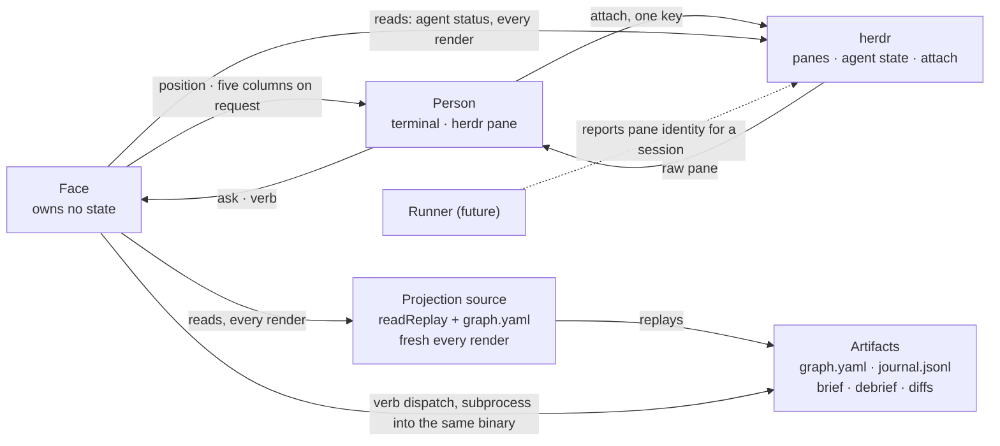

# Face

Design note · v0.1 · 2026-09-09

The read-only terminal that turns a graph of running sessions into a position you glance at
instead of a stream you tail — the same shape k9s gives a cluster of pods, aimed at a DAG of
agent sessions instead of a set of pods. This note is the thing we weigh against when it bends,
the same way 0001 is for the harness as a whole.

| | |
| --- | --- |
| Status | Draft, awaiting Rodrigo's read. Synthesized by a design workflow: four scouts (herdr, prior art including LangGraph, our own artifacts and projection, terminal and local-web options), three proposals from different postures, three judges with distinct lenses, two adversarial critics. The TUI-in-a-herdr-pane proposal won every lens; the others are grafted where noted. Nothing built. `face` depends on `runner-command-gate` in the bootstrap graph, and neither has been attempted. |
| Owner | Rodrigo Sasaki, own repository, Apache 2.0. Same wall as 0001: no employer's name, vocabulary or assumptions. |
| Composes | Reads the ledger's projection (`readReplay`, never `createLedger`) and the graph file, fresh on every render. Touches herdr through one adapter, shared with the runner. Never a second ledger, never a second truth. |
| How to read | Same conventions as 0001. Decisions are D-numbered, continuing from 0001's D13. A decision may bend with a written entry in the bend log below; an invariant bending means this design is wrong, not the invariant. |

## What we are pushing it for

Two outcomes, in order of weight. The third from 0001 — compounding — does not change here; the
face is a reader of that compounding, not a source of it.

**A position you can actually read, today.** No runner exists yet. The face does not wait for
one: it is buildable against the graph and the ledger already in this repository, against real
topology (`.interlock/graphs/0001-bootstrap.yaml`'s seven nodes) and a genuinely empty journal —
the first slice is a real exercise of graceful degradation, not a mockup of one.

**Never the second truth.** A face that remembers, caches, or accumulates state of its own is
exactly the trap D2 names. Every render, on every surface this note seeds, is a fresh join over
files that are already interlock's public API. The `face` node's own acceptance says this
literally: "it owns no state; killing the pane loses scrollback and nothing else."

## The shape

Five actors. The face reads two sources fresh on every render and keeps no copy between them;
every verb it accepts leaves its own process as a subprocess call, never a write; herdr is
reached through one shared adapter and tells the face nothing more than it already tells its own
sidebar. Raw attach skips the face entirely — person to herdr, direct.

*Figure 1. Five actors, one loop that never touches the face's own state. Verbs never write from
inside the face's process; they dispatch, as a subprocess, into the same binary the standing
gates already trust. The face writes nothing to herdr; the one write toward herdr, reporting
which pane a session runs in, belongs to the future runner. Raw attach bypasses the face entirely,
exactly as D1 says it should.*

## Decisions

Each carries its cost and the condition under which we would revisit it, same as 0001.

**D14. The face reads fresh, owns nothing, and keeps no copy between renders.** Two sources of
truth: the projection and the graph file. Two display reads that are not truth and are never
cached: `git` for showing a hunk a decision points at, and this note's own bend-log table. `readReplay` (`packages/ledger`'s
own pure replay, never `createLedger`) over the journal for gate, receipt, outcome and session
state; the graph file, read directly, for topology. `Node` is `{graph, id}` — no dependency
edges — by the ledger session's own decision c11, "that topology belongs to the interpreter,"
which does not exist yet. A face that read only the projection could never show a position at
all, so this formalizes the second read rather than avoiding it: a small loader checks
`graph@vN` on the graph file the same way the journal's own envelope checks `event@v1`, and
refuses a malformed one with a line, not a stack trace. Nothing is cached between renders; a
missing journal degrades to `emptyProjection()` (confirmed: `readReplay`'s own ENOENT path),
matching I5's shape generalized past the substrate to any missing input. `packages/face`, sibling
to `packages/ledger` and `packages/cli` in this repository's flat convention.
*Cost:* two read sources instead of one, joined by the face itself — `NodeView` and `SessionView`
are not pre-joined by `nodeKey`.
*Revisit:* when the runner exists and serves the HTTP read API 0001's own layers table already
names, a remote face reads over that instead. The view-model functions do not change; only what
feeds them does.

**D15. Verbs dispatch as a subprocess; the face's own process never writes the journal.**
`createLedger()` opens a live Journal, subscribes a projector, and attaches
`attachLedgerSink` — a plain `appendFileSync` writer — in one call: built for exactly one
long-lived writer, with no fs-watch, so a second process's concurrent writes are invisible to it.
Both are public exports of `packages/ledger`'s own index, so nothing stops the face at the type
level — this is enforced by a `no-write-surface` test (mirroring `runner-command-gate`'s planned
`one-adapter` test) asserting the face's dependency graph never reaches `createLedger` or
`attachLedgerSink`. Every verb but `status` shells to `interlock <verb> <node> --because "..."`,
the same `packages/cli/src/main.ts` group/action dispatch the `debrief-valid` gate already runs
through, and reads its exit code. Today that subcommand opens a short-lived `createLedger()`,
appends one event, and closes — an ephemeral writer per keypress, categorically different from a
long-lived runner connection. Tomorrow it becomes a thin call into the runner's control surface.
The face's own code does not change either time.
The mapping is mostly free — `kill` → `outcome-set{kind:"cancelled", authority, because}`;
`approve` → `gate-moved{to:"satisfied"|"waived", authority:human}`; `retry` and `answer` both
compile to `outcome-set{kind:"reset", receipts}` (Figure 2 draws "held → running" once for
both) — but two gaps in the ledger's own vocabulary surface here and are flagged, not
worked around: `Outcome`'s six kinds have no kind for a voluntary, non-failure hold, so `pause`
has no truthful mapping today (`held` requires a `failure` string a pause did not have); and
`reset`'s constructor takes only `receipts`, no `because` or `authority`, so a human-triggered
retry leaves no recorded reason, against I10's "accountability is a recorded reason, not a
restriction." Both are upstream, in the ledger's own types, and the face is only the first
consumer to hit them.
*Cost:* a verb round-trips through a process spawn instead of an in-memory call.
*Revisit:* no. This is the mechanism that keeps the face at zero write surface through the
runner, the HTTP API and the phone channel without a rewrite.

**D16. herdr integration: one adapter, mostly read, two narrow writes, attach untouched.** One
file, shared by the face today and the runner once it exists — the bootstrap graph's own line for
`runner-command-gate`, "herdr is touched in exactly one adapter file," read at the system's scale
rather than once per package. The face reads herdr's agent status on each render through the adapter, the same way it reads
the journal, sourcing herdr's own `blocked` signal into the position; a push subscription is an
optimization behind the same seam, and nothing it delivers survives the next render — Figure 2 already names this ("herdr's
agent state, from hooks or screen manifest"). `Session` is `{id, node}`: no pane identity, and
none should be added without baking a herdr-specific field into the ledger's own vocabulary. So
session-to-pane correlation is the (future) runner's job: it calls `pane.report_metadata` with
`source: "interlock"` and tokens naming the graph, the node and the session when it starts a pane,
and the face resolves "which pane is session X" by reading that metadata back through herdr's
own pane reads, rather than teaching the ledger about panes. `pane.report_agent` is not this
door: it is how an integration declares a pane's agent and its state authoritatively, and calling
it replaces herdr's own record of the agent. The runner learned that on the wire. The write direction stops there: the
adapter never writes interlock's own lifecycle (progressing, blocked, stalled, dead, held,
cleared, cancelled, superseded) into herdr's `state` enum (working, blocked, idle, done,
unknown). The two vocabularies are different partitions — `held` is not `blocked`, `stalled` has
no herdr equivalent — and a lossy translation into herdr's sidebar would make herdr's own UI lie
about what it actually knows, for a person's non-interlock panes too. Raw attach
(`herdr agent attach <target>` / `herdr terminal attach <id>`) stays exactly herdr's, one key
away, never reimplemented — D1's own floor.
*Cost:* a dependency on a funded company's socket API with no authentication (0001's own D3
line); the pane-correlation write needs the runner before the face can resolve which pane a
session is in — until then the overlay renders blank, not guessed.
*Revisit:* if a live check shows metadata from a second `source` does not compose with herdr's
native detection in the same sidebar row, verify before depending on it. Writing interlock's lifecycle back into herdr's
rollup is reversible with a written because if a real need appears; it is not the default.

**D17. Text is the primary surface; a browser is reserved for exactly two things text cannot
do.** Nothing the face has to say is inherently visual: position, five columns, decisions, even
hunks are text, and D12 deliberately keeps nodes and graphs small — the bootstrap graph's own
seven nodes already render as a legible position in one herdr pane. This is also what herdr's
plugin surface confirms, not a constraint routed around: a plugin pane is any argv command,
terminal-based only, never a webview. A browser is reserved for exactly two things text
genuinely does not do well: a spatially laid-out DAG for a graph too large or tangled to read as
ASCII, and a chart across many sessions — a strategy's instances over time, float trends across
runs — which is not "a position" of one graph by the vocabulary's own definition and was never
going to fit one pane. Both are absent today: no strategy exists yet, and float needs a receipt
duration that does not exist either — `Receipt` today carries only `id`, `gate`, `commitSha`,
`spend`, `derivation`, `proof`, despite duration being named in 0001's own Gates section prose.
When the web view is built, it reads the identical pure view-model functions the TUI uses, never
a second implementation with its own truth, and it never streams the raw journal as a debugging
convenience — axiom 3 holds in a live-update transport as much as in the TUI.
*Cost:* the graph and float views stay absent, not faked with placeholder edges or a made-up
number, until real topology and duration data exist to back them.
*Revisit:* once a strategy exists with two or three instances, or a real graph outgrows one
screen — build the web renderer then, over the same functions, per axiom 4.

**D18. Graph, brief and strategy stay plain-text-editor-plus-CLI-validate; the face never
authors or mutates one.** Three things already in the repository make this the only defensible
answer: the seams table lists hand-authored and scripted graphs as a peer to the model as
producer, never superseded by it; Compatibility's own line — "a hand-authored file that is wrong
gets a sentence, not a stack trace" — names a CLI-validate failure mode, not a form's; and brief
is "immutable once the session starts," leaving a live-editing affordance no legal moment to run
in for the one window the face is open. Concretely: whenever the face loads one of these files to
render a read, it runs the same validator the CLI runs (`interlock debrief validate`'s own
not-implemented stub is already wired as the `debrief-valid` standing gate) and shows that
validator's message verbatim — one validator, two callers, never two implementations that can
drift. The one legitimate write-shaped affordance is reviewing an interpreter-proposed graph
draft — "the read... which the person corrects" — and even there the face stays out of form
territory: approve, or correct-with-a-reason that reopens the interpreter, never a field-by-field
editor. Every correction is a gap.
*Cost:* no in-face graph builder, ever, including for the one review exception — correcting a
draft means opening an editor, not filling fields.
*Revisit:* no. D2 is the reason: letting the face construct or mutate these files grows it real
state and behaviour beyond "read position, write intents."

**D19. LangGraph is not a dependency at any layer interlock owns.** LangGraph's state — and its
flagship UX, checkpoint replay and time travel — lives inside its own checkpointer, its own
store, addressed by thread and checkpoint id, surfaced by a separate server (Postgres and Redis
in production); adopting it anywhere interlock owns judgment would couple the one artifact D13
says anyone may author (the graph file) to one SDK's object model, would let a running server
hold truth the way D2 names as the trap, and would stand up a second, competing journal beside
the Phyxius one 0001's own non-retrofittable seam already commits to — two systems both claiming
to know what happened to one unit of work, with no mapping onto lease, gate, spend or a conserved
retry budget. It is not a dependency here, now or through any seam this note names; its genuinely
useful ideas — a graph rendered from code doubling as a correctness check on a hand-authored
graph's edges, and `interrupt_before`/`interrupt_after` as placement vocabulary for where a
`held` state can be declared — are worth stealing as plain code, the way axiom 4 licenses
composing with a layer that carries none of our judgment, never as an import into one that does.
*Cost:* none — a plain-code validator over the graph file's edges, if built, is a few dozen lines,
not a dependency.
*Revisit:* never on principle, same footing as D1.

## Views

Nothing below is built; no face exists yet. "Exists today" means whether the data exists to
answer the view, not whether a screen renders it.

| view | data it needs | exists today? |
| --- | --- | --- |
| Position (per node) | `NodeView.gates`/`.receipts`/`.outcome` (projection) + node id (graph file) | Partial — gate and outcome data is the best-covered part of the projection; topology is the second read D14 formalizes |
| Critical path | `depends_on` edges (graph file) | The edges exist; an unweighted path over them is real topology, not a placeholder |
| Float | critical path + a receipt duration | No — `Receipt` carries `id`/`gate`/`commitSha`/`spend`/`derivation`/`proof` only; no duration field despite one named in 0001's Gates prose |
| Node detail (gates + receipts) | `NodeView` as-is | Yes — the best-covered view; `Gate`'s five kinds and `Outcome`'s six match AGENTS.md's vocabulary exactly |
| Session · Brief | `SessionView.brief` | Yes, in full |
| Session · Context | `Debrief.headSha` + declared gates (`Brief`) | Partial — head SHA exists; the on-disk `debrief@v1` YAML already carries `derivation{runtime,model}`, `graph_base_sha`, `session_start_sha`, `gates_run_by_agent`, but the `Debrief` TS type in `packages/ledger` doesn't, and nothing converts a debrief file into a `debrief-filed` event yet |
| Session · Discoveries / Decisions | `SessionView.debrief.discoveries`/`.decisions` | Yes once filed, but no code today files one from an on-disk `debrief.yaml` |
| Session · Outcome | join `SessionView` with `NodeView` by `nodeKey` | Yes, but unindexed — the two views aren't pre-joined by session; the face performs the join |
| Decision → hunk | `Decision.hunks` (`path:lines`), resolved via `git show`/`git diff` in the worktree | The pointer exists once a debrief is ingested; `Mark`'s four kinds are fully typed in `mark.ts`, but no `LedgerEvent` kind ever populates one — `verifier-hunks` hasn't been built |
| Liveness (progressing / blocked / stalled / dead) | `Lease.expiry`/`leaseExpired` (real) + herdr agent-status (D16) + a stall threshold | Raw ingredients exist; no threshold computation exists anywhere; `blocked` is entirely herdr's signal |
| Six verbs | `status` is a pure read | `status`: yes. The other five have no `LedgerEvent` kind at all — that machinery is `runner-command-gate`'s, dispatched per D15 |
| Bend log | this note's own markdown table | Yes, as a third read source — the file itself, best-effort, never a ledger artifact |
| Gap log | `Debrief.open` (free text) | Partial — only unstructured text exists in practice; the structured `Gap` type (`mark.ts`) has no producer yet |
| Strategies | a strategy file + its instances | No — zero type, file format or projection exists anywhere |
| Raw attach | herdr's own `agent attach` / `terminal attach` | Yes, herdr's own, one key away, never rebuilt |

## Seams, and the first thing through each

| seam | first through it | added later through the same seam |
| --- | --- | --- |
| Face read source | `readReplay` + a direct read of the graph file, polled | The runner's HTTP read API (already named in 0001's layers table); the view-model functions do not change |
| Verb dispatch | A subprocess into `interlock <verb>`, opening and closing a short-lived `createLedger()` per call | The identical subprocess call, dispatched instead into the running runner's control surface |
| herdr adapter | Read-only agent-status overlay, shared with the (future) runner | `agent.explain`'s derivation-shaped read, surfaced for a blocked or stalled node without re-deriving why |
| Graph review | Read-only rendering of a hand-authored or self-run graph | Approve, or correct-with-a-reason, over an interpreter-proposed draft, once the interpreter exists — through the same subprocess boundary as the other verbs |
| Rendering surface | A terminal render tree in a herdr pane | A second, browser renderer over the identical pure functions, for exactly the two cases D17 names |
| The phone channel | Not first through here — D9 names it | Reads the identical read source, posts the identical verbs; a second door, not a new mechanism |

## Not modeled

- **A rich stateful assistant.** D2 holds; the face does not remember what you asked five
  minutes ago beyond what the projection can tell it again right now.
- **Multi-graph or multi-tenant merged position.** One ledger, one substrate address, matching
  0001's own "not modeled" list; more than one graph file can sit side by side, never merged into
  one read.
- **A local cache or database of any kind.** Every render, on every surface this note seeds, is a
  fresh join over the projection and the graph file.
- **An embedded terminal.** Raw attach stays herdr's, one key away; the face never re-types a
  multiplexer.
- **Notifications or a push system inside the face.** That is D9's separate, later-seamed
  channel.
- **A face-owned graph builder,** including for the one review exception in D18.

## Bend log

Every time this design bends in use, an entry. A bend against a decision is expected and
recorded. A bend against an invariant means we redesign, and the entry says how.

| date | what bent | against | why | way back kept? | learned |
| --- | --- | --- | --- | --- | --- |
| 2026-09-10 | D16 named `pane.report_agent` as the identity write; the first live run showed it is the integration door that declares an agent and its state, and it erased the started agent's record | D16 | The design was written from herdr's docs; the wire said otherwise. | Yes, previous text in history | Identity travels as `pane.report_metadata` tokens; agent state is only ever herdr's own. |

---

Vocabulary proposed: `strategy`, already a section in 0001 and used above, awaiting its row in
AGENTS.md by ratification. Nothing else above is new; a face that needs another noun writes it
here before it ships, not after.